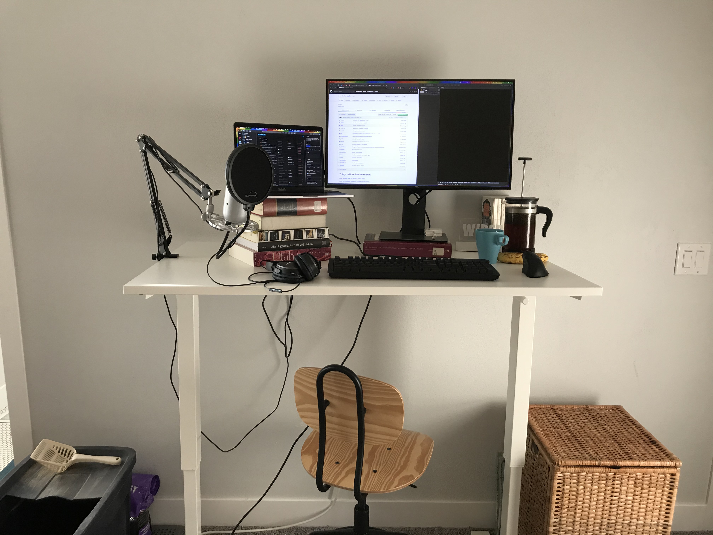
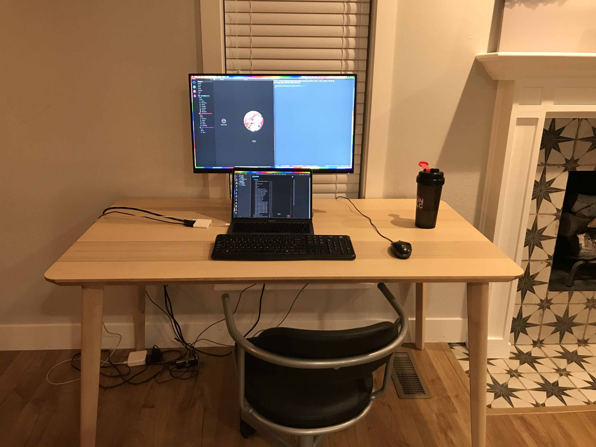

I've been working from home for 5 weeks, since COVID-19 was declared a pandemic and I thought I would share how I have my work from home space set up.

My wife and I have been splitting our days, each of us spending half the day focused on work, and the other half helping our son with online public school and trying to get a little work done if possible. That means we have 2 desks that we trade places at each day. In the morning, I'm in the bedroom focused, and in the afternoon, I'm in the living room.

## Morning Desk

Working right next to the cat's litter box is not ideal, but on the bright side, it does remind me to scoop her litter more often.

- [Ikea Skarsta sit/stand desk (47" wide)](https://www.ikea.com/au/en/p/skarsta-desk-sit-stand-white-s39324819/)

    I went out and bought this on the first day I was working from home (back when we thought it might only be 2 weeks), and I don't regret it at all. I use the standing feature everyday and I stand most of the morning. It's not as inconvenient as I thought it would be to use the crank to raise and lower it. It's a little small for a desk, but that's perfect for our bedroom where we don't have a lot of room to spare.

- [Ikea Kullaberg Swivel chair](https://www.ikea.com/us/en/p/kullaberg-swivel-chair-pine-black-10320341/)

- [Dell UltraSharp 27-inch USB-C Monitor (2719DC)](https://www.amazon.com/Dell-Ultrasharp-U2719DC-Performance-Compatible/dp/B07JQTNCGB/)

    This monitor is my employer's and they graciously allowed me to take it home for now. It's amazing because I just sit down, plug in one cable to my computer and I'm good to go. The cable provides power to my macbook and I have my microphone and keyboard plugged into the monitor. Then I have the bluetooth receiver for my mouse plugged into the keyboard. And I have my headphones plugged into my microphone.

- [Blue Yeti USB Microphone](https://www.amazon.com/Blue-Yeti-USB-Microphone-Silver/dp/B002VA464S)

    This isn't the best microphone, but it's not cheap either and it's a good step up from using your computer or headphones mic.

- [Microphone boom arm](https://www.amazon.com/gp/product/B00DY1F2CS/)

- [Microphone pop filter](https://www.amazon.com/gp/product/B00HBN6T1I)

- [Bose QuietComfort 25 Acoustic Noise Cancelling Headphones](https://www.amazon.com/Bose-QuietComfort-Acoustic-Cancelling-Headphones/dp/B075V33WMN)

    I got these from a previous employer and have really enjoyed them, although I rarely use the noise cancelling feature.

- [Das Keyboard 4 Ultimate](https://www.daskeyboard.com/daskeyboard-4-ultimate/)

    I love this keyboard, unfortunately my wife doesn't enjoy typing with blank key caps, so I move it out of her way so she can use her wireless Apple keyboard in the afternoons.

- [Perixx PERIMICE-608 Ergonomic Mouse](https://www.amazon.com/gp/product/B018Y0RWNA)

- [Ikea Upphetta French press](https://www.ikea.com/us/en/p/upphetta-french-press-coffee-maker-glass-stainless-steel-60241389/)

- [Ikea Färgrik Mug](https://www.ikea.com/us/en/p/faergrik-mug-turquoise-50234803/)

- [Wired In sign](https://wearewired.in/)

    This is a prototype of a Wired In sign that I got off of Kickstarter, so mine doesn't plug into the computer. I just have a switch on the bottom. I'm not using it as much right now because no one is in the room when I'm working.

## Afternoon Desk

- [Ikea Lisabo Table](https://www.ikea.com/us/en/p/lisabo-table-ash-veneer-70294339/)

    This is our old dining room table. We set it aside when we got a new table, and then ended up using it as a spare desk when we started working from home. Thankfully we hadn't gotten rid of it yet.

- Ikea Rutger Jules swivel chair (This might be discontinued)

- Logitech mouse and keyboard

- [Apple USB-C Digital AV Multiport Adapter](https://www.amazon.com/Apple-USB-C-Digital-Multiport-Adapter/dp/B07WF96FY5)

- [Gear Head USB 2.0 4-Port Hub](https://www.amazon.com/dp/B004OBZ088)
