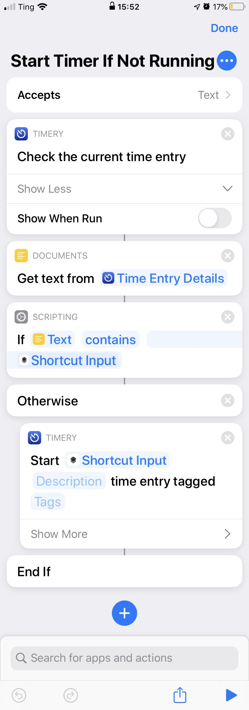
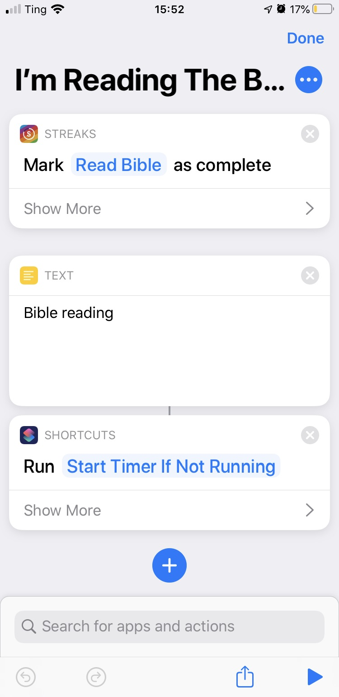

I have a lot of shortcuts that start [Toggl](https://toggl.com/) timers with [Timery](https://timeryapp.com/). But the problem was that I don't want to start a timer if it's already running. I want all of my shortcuts to be a bit more idempotent so that I can run the shortcut multiple times (in case it fails).

For example, I have a shortcut that start a "Bible reading" timer when I open the [Bible app](https://www.bible.com/app). I may close that app and then go right back to it. I don't want it to have multiple "Bible reading" timers in a row, just one.

So I made a shortcut called [Start Timer if Not Running](https://www.icloud.com/shortcuts/6ada705a33d246828d50dbb1fdf03666) and I use it like a function. I run this shortcut inside another shortcut anytime I want to start a timer (unless the timer needs a description).

It accepts text as input, which is the name of the timer to start. Here is an example of how I use it:

 It checks to see if it's already running, and if not, it starts it. You can get it [here](https://www.icloud.com/shortcuts/6ada705a33d246828d50dbb1fdf03666).
