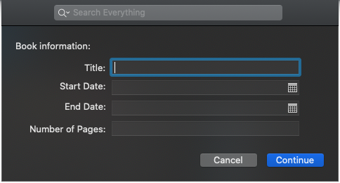
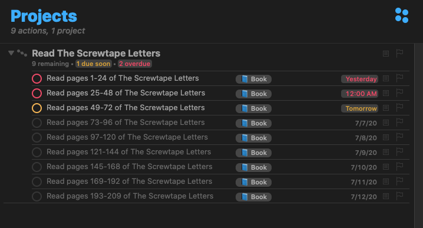

I read books on a [couple of](https://www.orbit.fm/bookbytes) [podcasts](https://www.orbit.fm/imprint), which means that I need to finish reading the book by a certain date. I was using [Joe Buhlig](https://joebuhlig.com)'s [Read Book script](https://github.com/joebuhlig/OFScripts/tree/master/Read%20Book%20Tasks), but it only worked on the mac and I wanted to be able to set up a new book project on my iPhone or iPad. He actually [switched over to Workflow (now Shortcuts)](https://joebuhlig.com/moving-omnifocus-scripts-to-ios/) back in 2016, but this doesn't work on the mac.

Omni Automation now allows scripts for OmniFocus to work across all devices, so I decided to write one for reading books. It asks you the name of the book, the start date, the end date, and the number of pages.

Then it creates a new project with the tags specified in the script, and it takes you to that project.

You can [install it from GitHub](https://github.com/agarrharr/OFScripts/tree/master/Read%20Book).