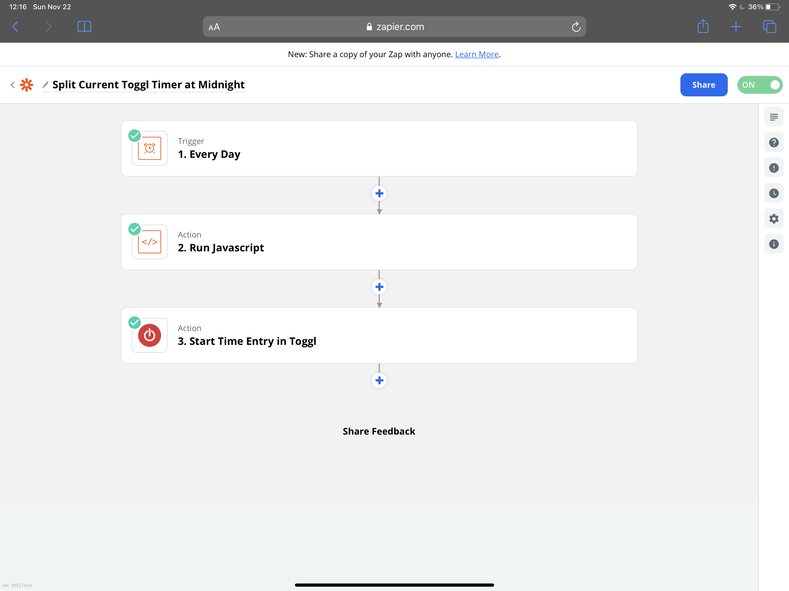
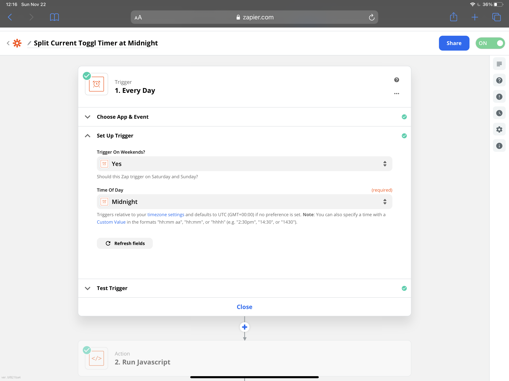
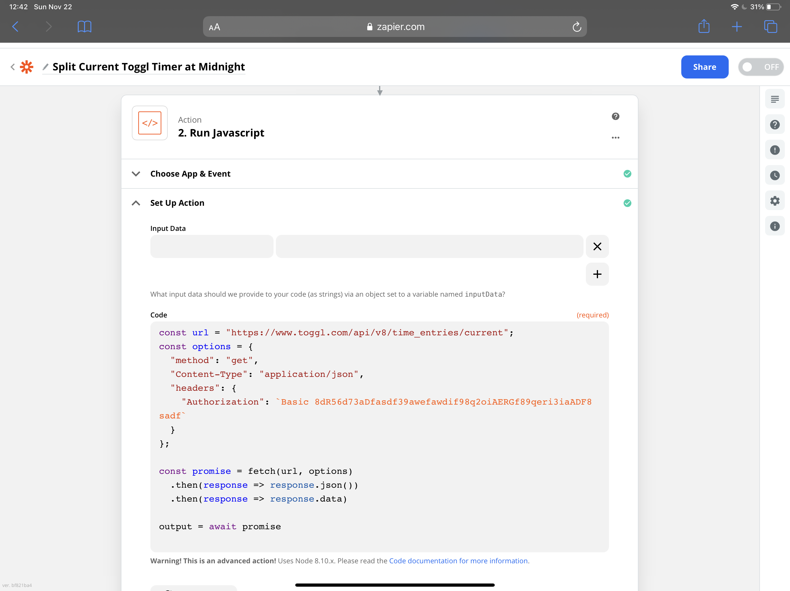
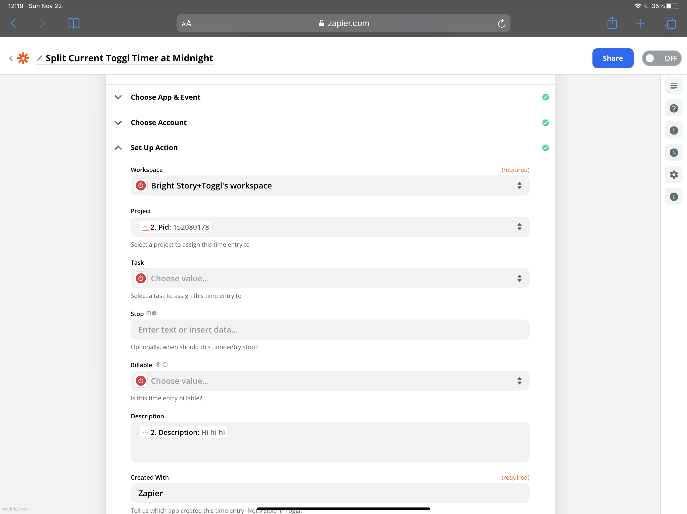
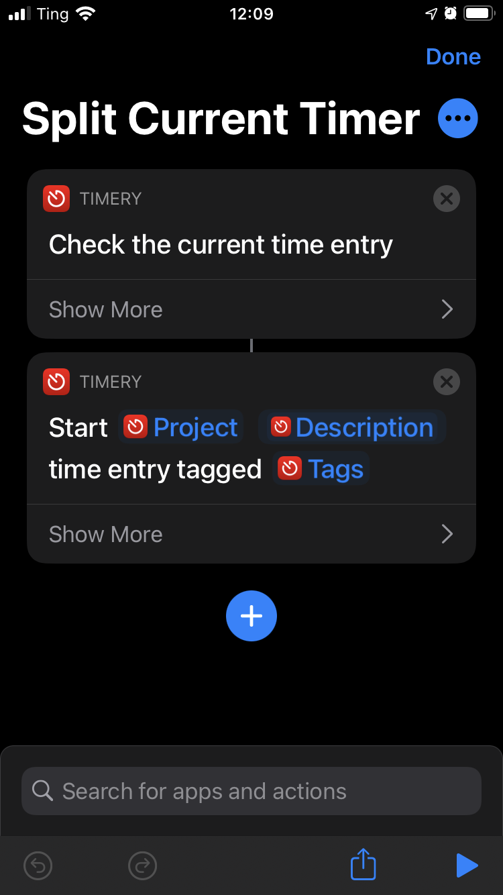
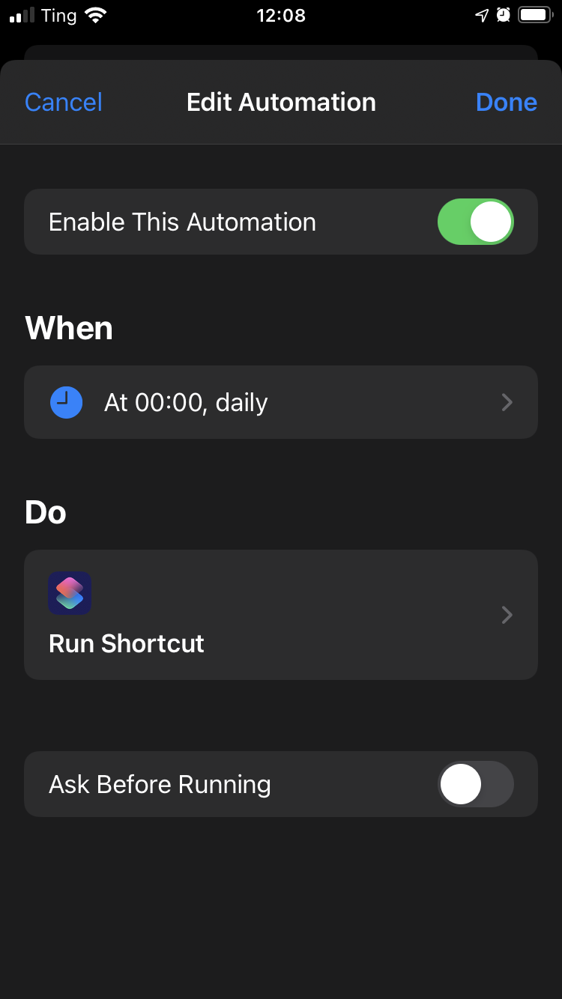
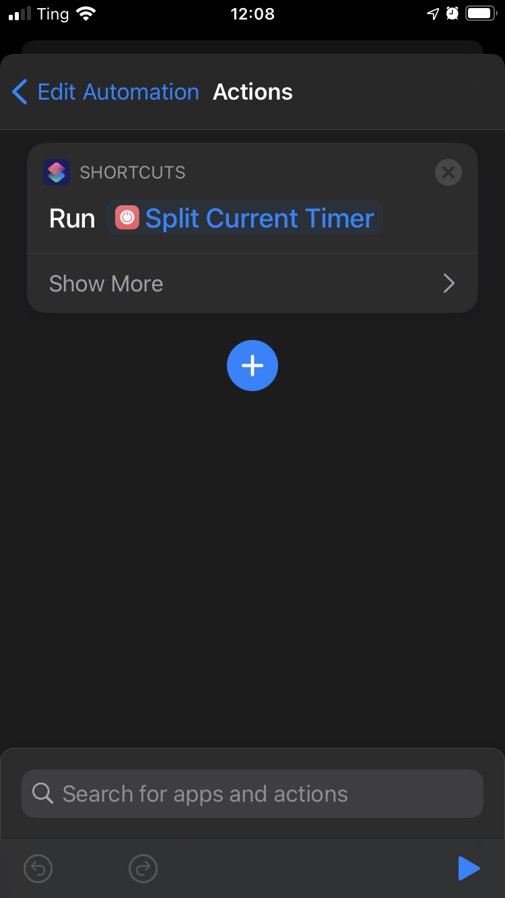

## TLDR

I made an automation that stops the current timer at midnight and starts another identical timer. There are 2 ways I came up with to do this:

Zapier -> Toggl API

Or

Shortcuts -> Timery

## Motivation

I time track 24 hours a day. I even have a timer for sleeping. Part of the reason for tracking sleep is so I know I’ve tracked all 24 hours each day. I can look at the charts on Toggl’s website or in the Timery app to make sure I didn’t miss anything.

In order to do that, I have to make sure whatever timer is running at midnight stops and starts again. Usually this is a sleeping timer, but occasionally it’s something else if I’m staying up late.

I was using Zapier for this and it works great. When iOS 14 came out, I was excited to try doing this with the new “Time of Day” triggers. I went and set it up, but it never ran. Then when I got the update to iOS 14.2 it suddenly started working.

## Zapier

Here is how to set it up in Zapier. It’s a time trigger, and 2 steps.

The zap gets triggered at midnight each day

The first step gets the current timer with JavaScript and the Toggl API. You have to change the authorization string. It’s “Basic” followed by a space and then a code. You can come up with the code with the following explanation from [Toggl’s API documentation](https://github.com/toggl/toggl_api_docs/blob/master/chapters/authentication.md)

> 1. Username and password are combined into a string username:password or if you use the api token it should be combined xxxx:api_token (xxx indicating user's personal token)
> 1. The resulting string literal is then encoded using Base64

And lastly, it using a Toggl action to start a timer with the same project and the same description.

## Shortcuts

This is a lot easier to set up. The only downside is that it won’t work if your phone is off or if it doesn’t have an Internet connection.

First make a Shortcut to split the current timer, or download mine. Here is a link to the [Split Current Timer Shortcut](https://www.icloud.com/shortcuts/ce16a191529244f791f8fab641ed144c).

Then set up an automation that runs automatically at midnight each day. Make sure you turn off “Ask Before Running”.

And the only action it needs to run is the “Split Current Timer” shortcut.

