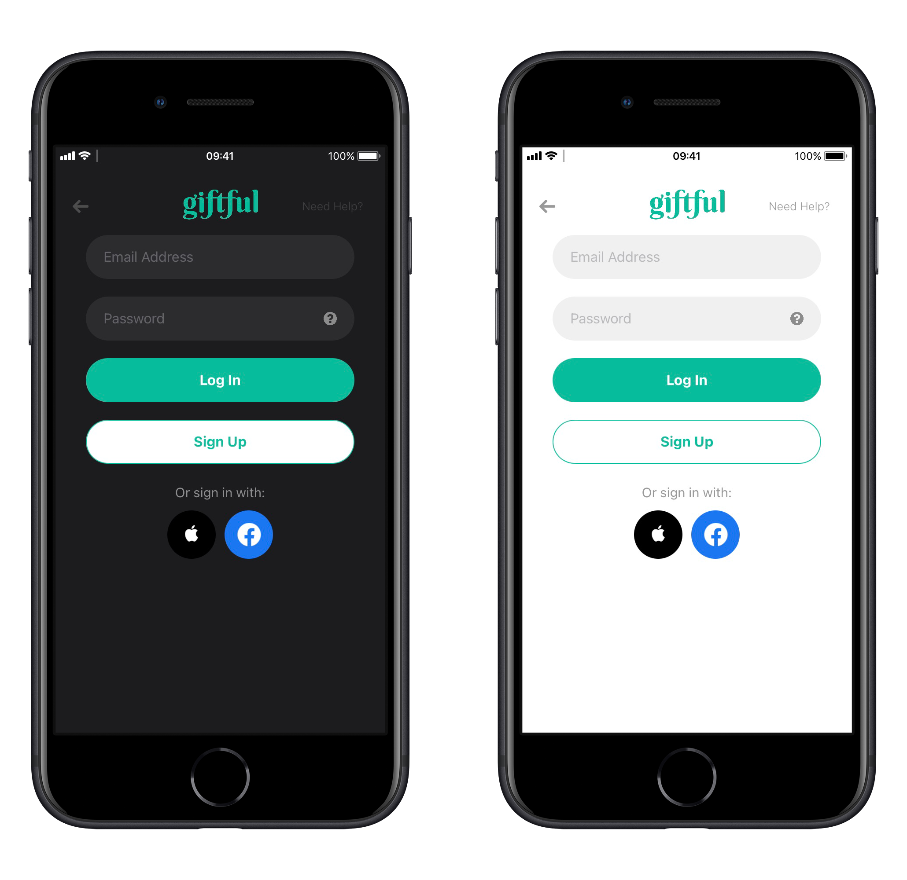
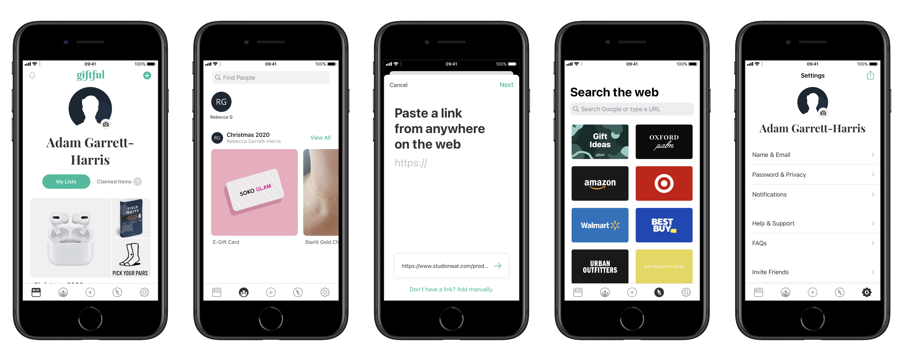
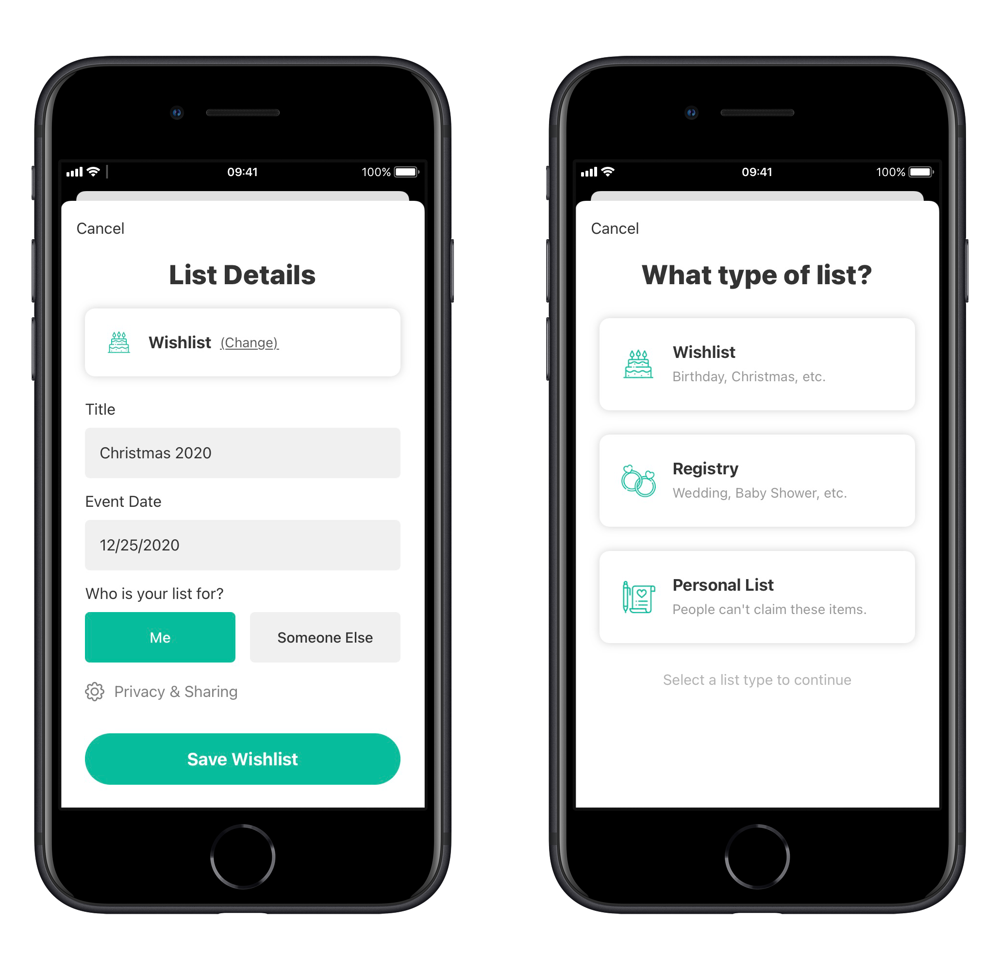
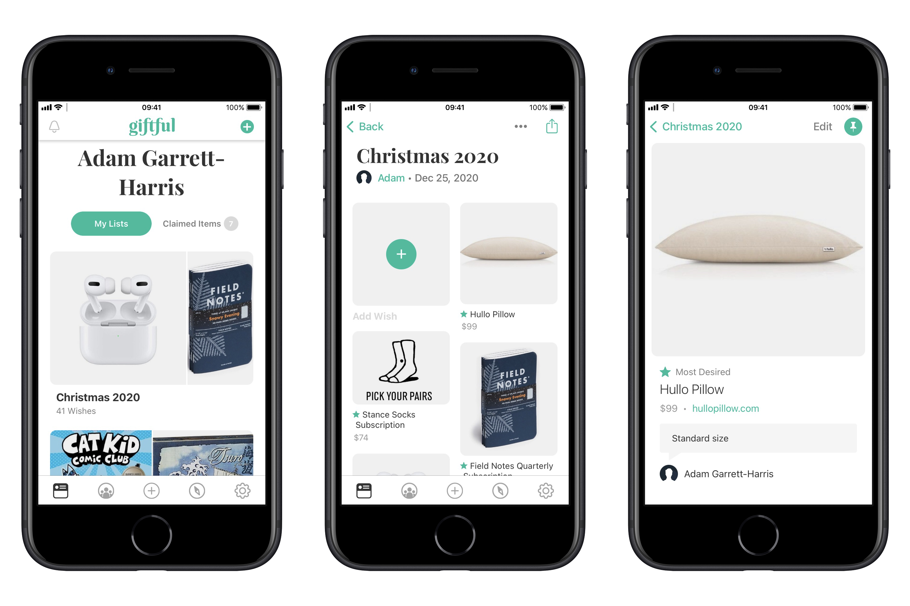
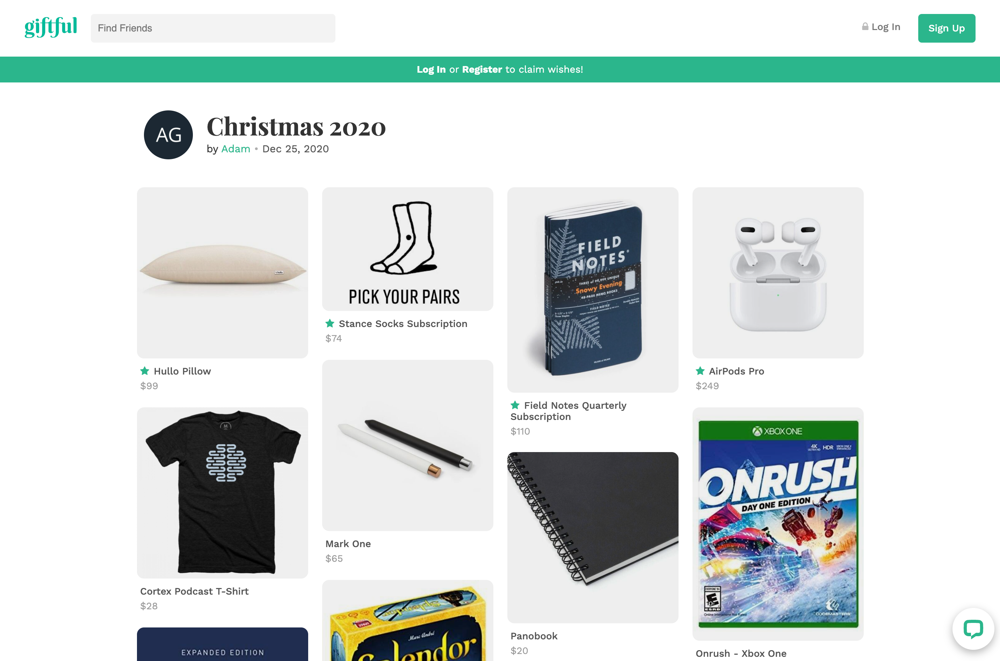
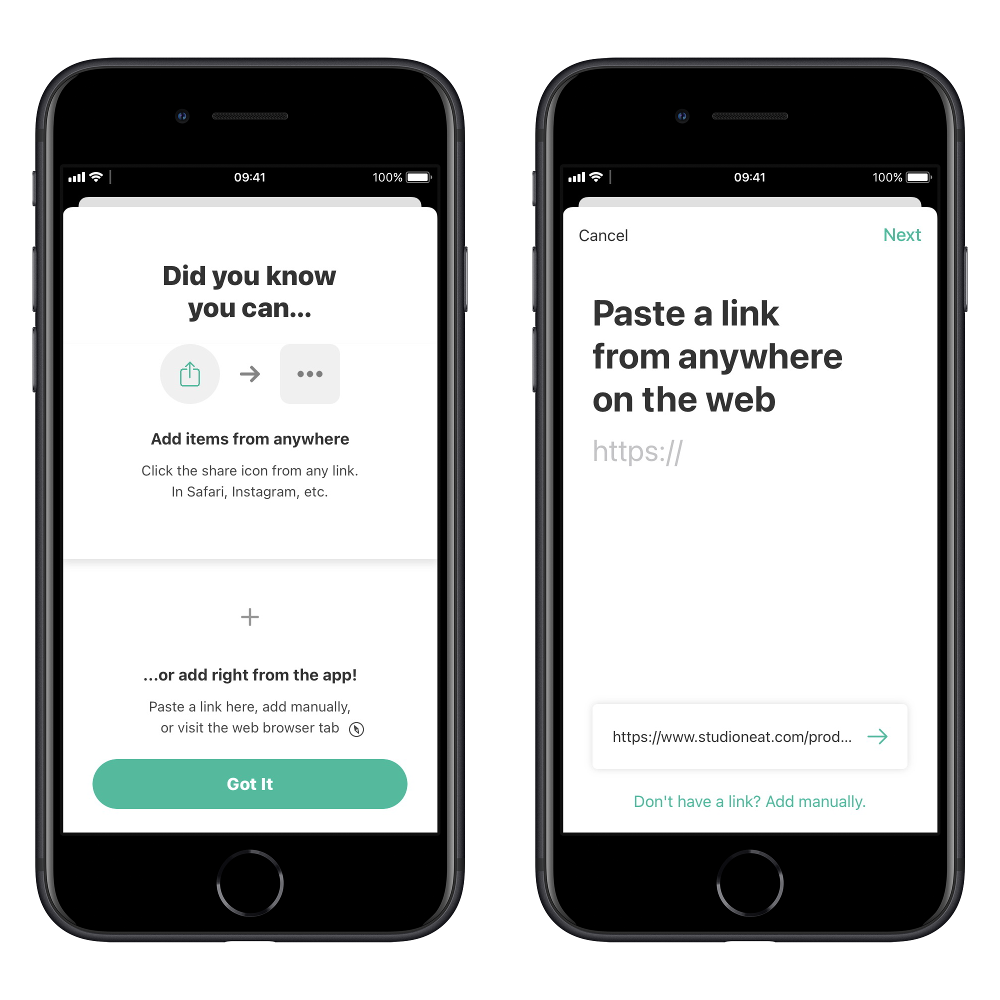
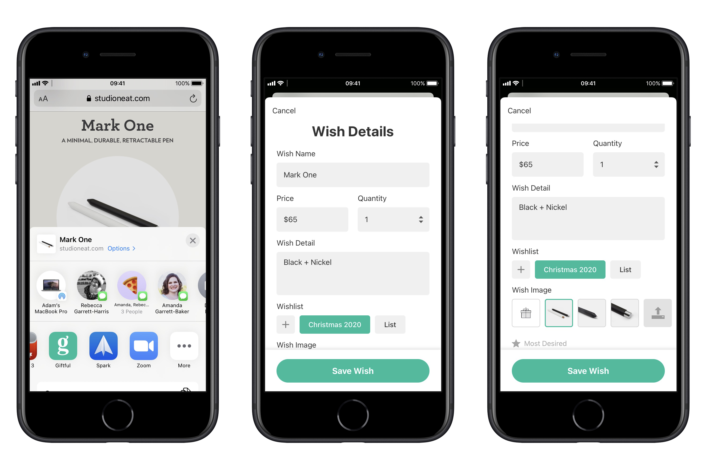
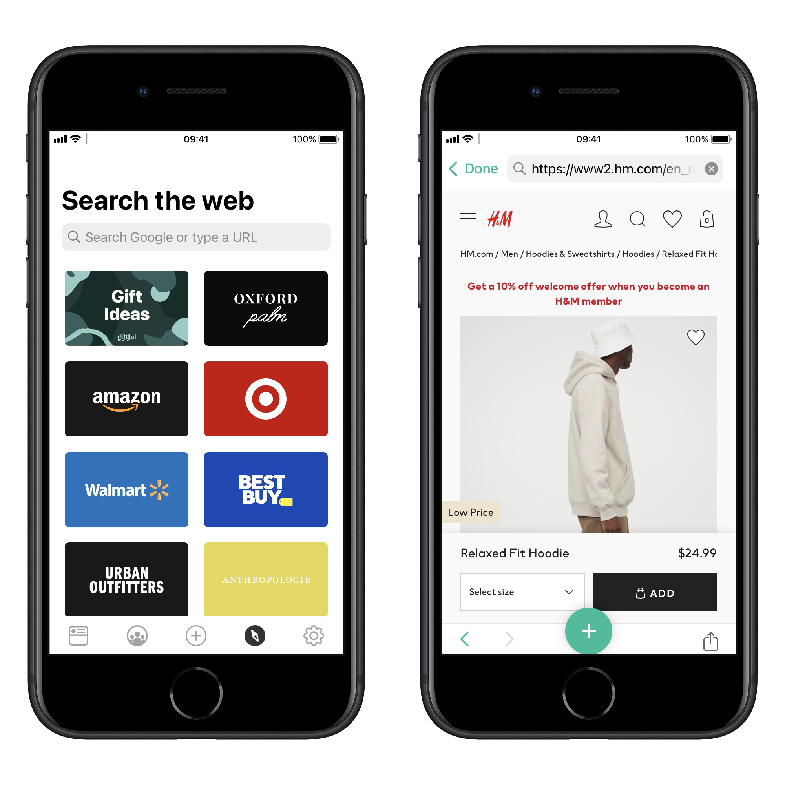
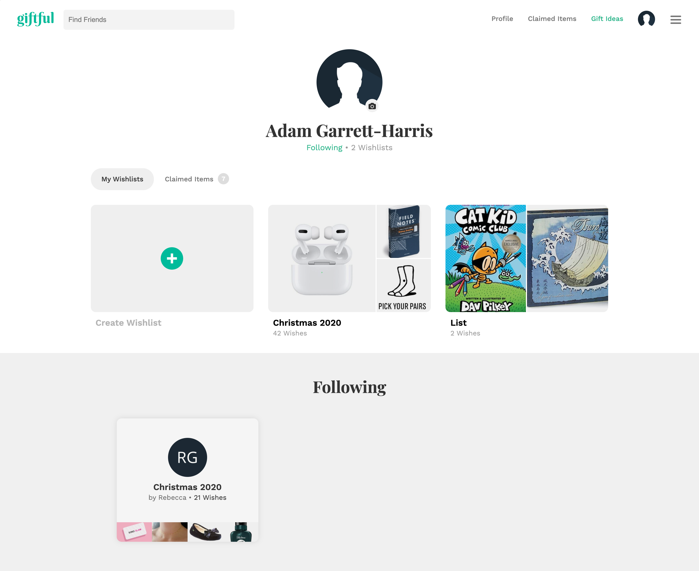
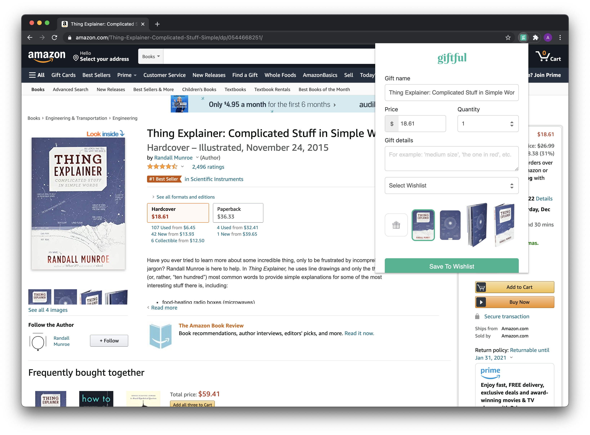

My wife and I like surprising each other for Christmas, but we still want to give each other ideas. I used another Christmas list app for several years now, but this year, when I went to sign in, there was a PHP error on the page. This sent me on a quest to find the best app for my wife and me to use for our Christmas lists.

## My requirements were:

- Ability to combine items from across the web
- Ability to share with others with or without iOS
- Ability to mark an item as purchased (without the list creator knowing it)

[Giftful](https://giftful.com/) by husband and wife team, [Cono Onorato](https://www.instagram.com/cono87/) and [ Hannah Onorato](https://www.instagram.com/hannahjoyonorato/) delivers on all of these and more, and it's a modern iOS app that's a delight to use.

Right off the bat, Giftful takes advantage of Sign in with Apple, which makes signing up fast and easy, and supports dark mode.

The app is organized into five sections: Home, Friends, Add, Browse, Settings.

On the Home tab, you can see your lists, your claimed items, and you can make new lists.

New lists can be a wishlist, a registry, or a personal list. You give your list a name and an event date. If you type Christmas, it automatically sets the date, which is a nice touch (I don't know if it works for other holidays, but I tried Valentines and it didn't work). You then choose if it's for yourself or someone else and the privacy level. You can make it open to anyone with the link, private, or collaborative.

On the Home tab, you can also tap into any of your lists and to view or edit your items, or add new items. And when you're ready to share your list with someone, you can press the share icon at the top right. That brings up a standard share sheet where you can message someone or copy the link. If they have the app, it will take them right there, otherwise, it will take them to the website.

The web interface displays the list in a beautiful and clean interface where anyone can view the list without an account (if your privacy settings allow it). If someone wants to claim an item, they'll need to create an account, but I love how it's not required to view the list. This means I can use Giftful with all of my family and not worry about what platform they use.

On the Friends tab, you can search for people (if they didn't already send you an invite). You can find anyone who has their profile set to public and you can see all of their public lists.

One thing that makes Giftful so great is the number of ways you can add items. The first way is by tapping the plus icon at the bottom center. The first time you do this, the app teaches you how you can also add items using the share sheet. If you already have something in your clipboard, the app will detect it and you can just tap the URL at the bottom of the screen. You also tap the plus button from within a specific list.

My favorite way to add items is to browse the web on iOS in Safari and use the share sheet to send items to Giftful.

Whichever way you add your item, it automatically pulls in the name, the price, and all of the images of the item from the site to choose from. You can edit any of these, plus you can choose the wishlist (or add a new list right there), add the quantity, any details about the item like color or size. If you don't like any of the pictures it pulled from the web, you can choose to not use a picture, or upload your own. You can also add a star if this is one of your most desired items.

You can also browse within the app. The Browse tab has a list of common sites, but you can visit any website by searching or typing a URL.

You can also add things on the web by pasting a URL into the Giftful website, where you'll have all of the same options.

Or you can make it even easier by using their handy Chrome plugin to add items as soon as you find them.

If all else fails, you can always add an item manually. You can choose an image and type in all the details yourself. The only downside to this is that you can't add a URL, but it's good for items that you can't get online.

Giftful has just about every way of getting things into it covered. The only things I would like to see would be drag and drop on iPadOS, adding an item from a photo with the share sheet, and a Safari extension on macOS. I would also like to see multi-window support on iPadOS, as well as context menu support, but those are minor complaints.

Giftful is a beautiful and well-thought-out app that takes advantage of many modern iOS features and has great sharing and collaboration features. I would recommend this to anyone looking to make a Christmas list, a wedding or baby shower registry, or lists of things to buy for yourself or with a partner.

There are even more features that I can't cover here like the ability to download a pdf of the registry after the date of the event, creating a list for someone else, and the activity area (bell in the top left). Thankfully, they provide a [useful FAQ online](https://giftful.com/faqs).

Giftful [is available as a free app on the App Store](https://apps.apple.com/us/app/giftful/id1450175505) and according to the FAQ, always will be free. I chatted briefly online with Cono (one of the creators), and he assured me that they're in it for the long haul and that Gitful 2.0 will be launching sometime in 2021. I look forward to using it for my next Christmas list!
