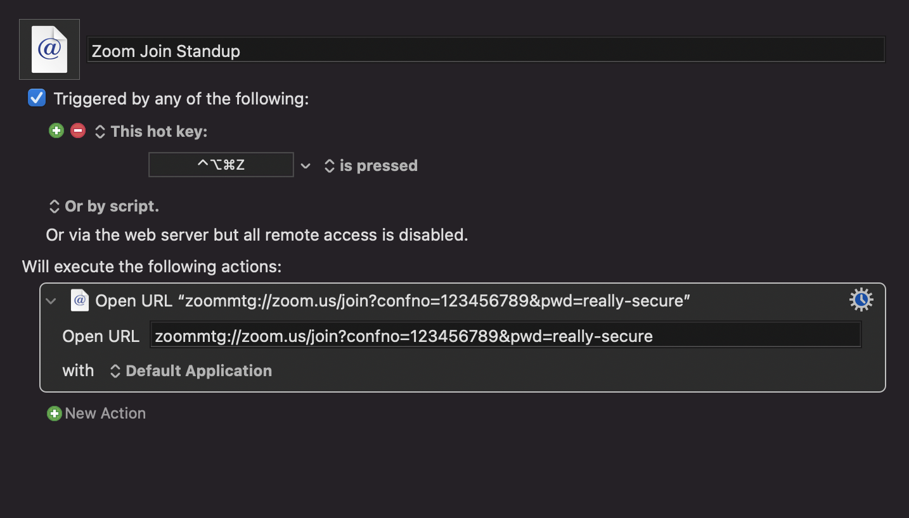
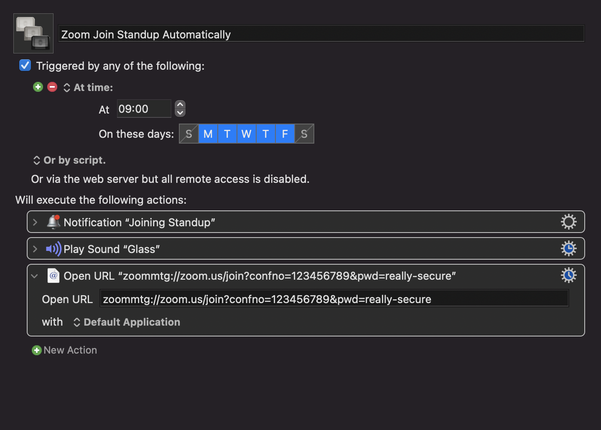

Like a lot of people, I've been working from home for most of this year. My team has a daily standup meeting every day. I got tired of going to the calendar and clicking a Zoom link. It would open up a tab in my browser, which would open a model that I would have to confirm, which would finally open the meeting in Zoom. So I made this Keyboard Maestro macro that allows me to hit a keyboard shortcut to open the call directly in Zoom. The trick is to use the  `zoommtg://zoom.us/join?confno=meeting-id` URL instead of the `https://company.zoom.us/j/meeting-id URL.` The other trick is to have the `?pwd=password` on the URL so that you don't have to enter a password.

After I made that macro, I found that sometimes I would be sitting at my computer and completely forget to join the meeting on time. So I made another version of this macro that automatically runs at 9 am every day. I also have it display a notification and play a sound so that I know it's happening. I also went into the Zoom settings and turned on "Always Mute My Microphone" and "Always Turn Off My Video."

