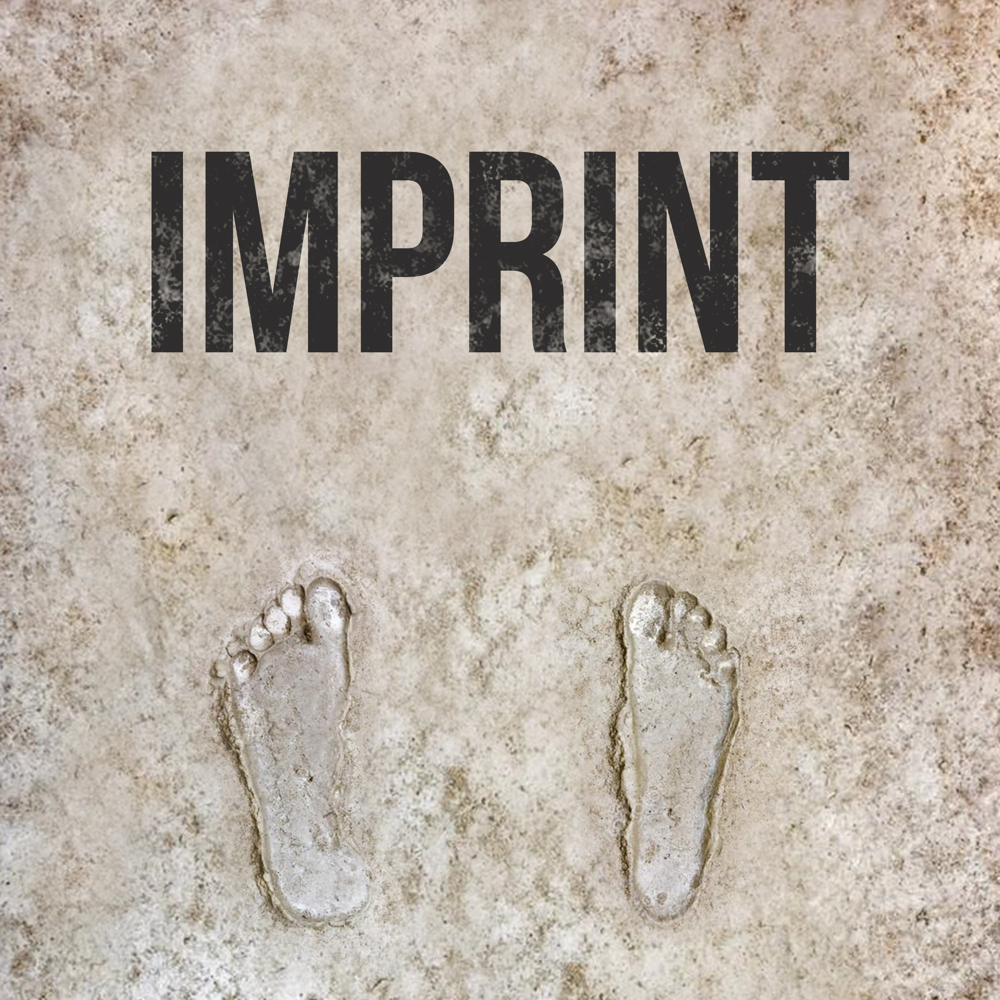

On [this episode of Imprint](https://www.orbit.fm/imprint/11), Jonathan and I talked about "Searching For God Knows What" by Donald Miller. The only book by him that I had read before this was "Blue Like Jazz" back in college and I didn't really understand his memoir style of writing. This time I liked his style a lot more.

We also talked about some other books we read.

Jonathan read:

The Magician's Nephew by C.S. Lewis

I read parts of:

- Church History in Plain Language by Bruce L. Shelley
- The Checklist Manifesto by Atul Gawande
- How to Take Smart Notes by Sönke Ahrens
- Do Nothing by Celeste Headlee
- Clean by James Hamblin
- Our Gang: A Racial History of The Little Rascals by Julia Lee
