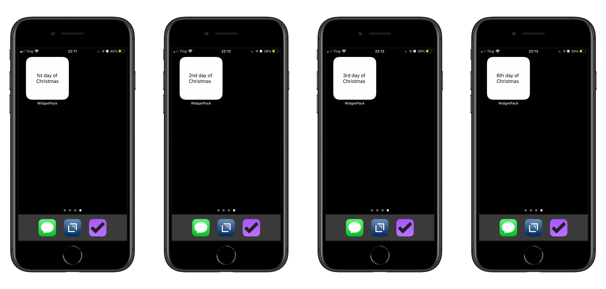

I've been meaning to make a custom widget with WidgetPack and I finally did. My family and I have been celebrating the [Twelve Days of Christmas](https://en.wikipedia.org/wiki/Twelve_Days_of_Christmas), which is from December 25th through January 5th. I made a widget that says which day of Christmas it is

WidgetPack is interesting and powerful because you can create custom widgets using Shortcuts. It's also a bit hard to understand how to use. I still haven't figured out exactly how to make them look nice.

I've taken inspiration from [Scotty Jackson](https://heyscottyj.com/) who has been [designing some amazing widgets with WidgetPack and Charty](https://heyscottyj.com/2020/11/18/my-reimagined-productivity-home-screen/)

Here is what the Shortcut looks like:

I manually added the date for Christmas at the top. I couldn't think of anything to automatically figure out the nearest Christmas date.

After that, most of the code is to figure out how to write the number as an ordinal number (1st, 2nd, 3rd, 4th, etc).

Then I add the test to "x day of Christmas," where x is the ordinal number.

To keep it up to date, I created an automation that runs this shortcut every day at 3 am.

You can [download the shortcut here.](https://www.icloud.com/shortcuts/c33c212d6f9a49ea9562281aea666b65)