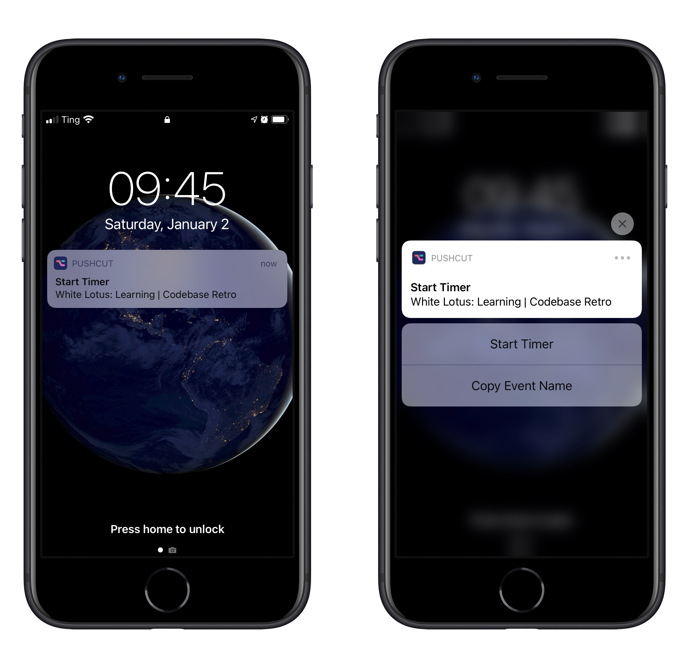
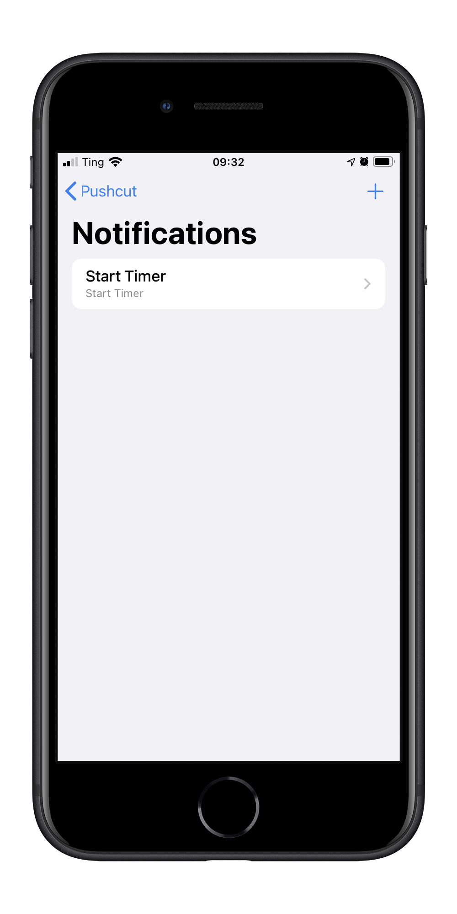
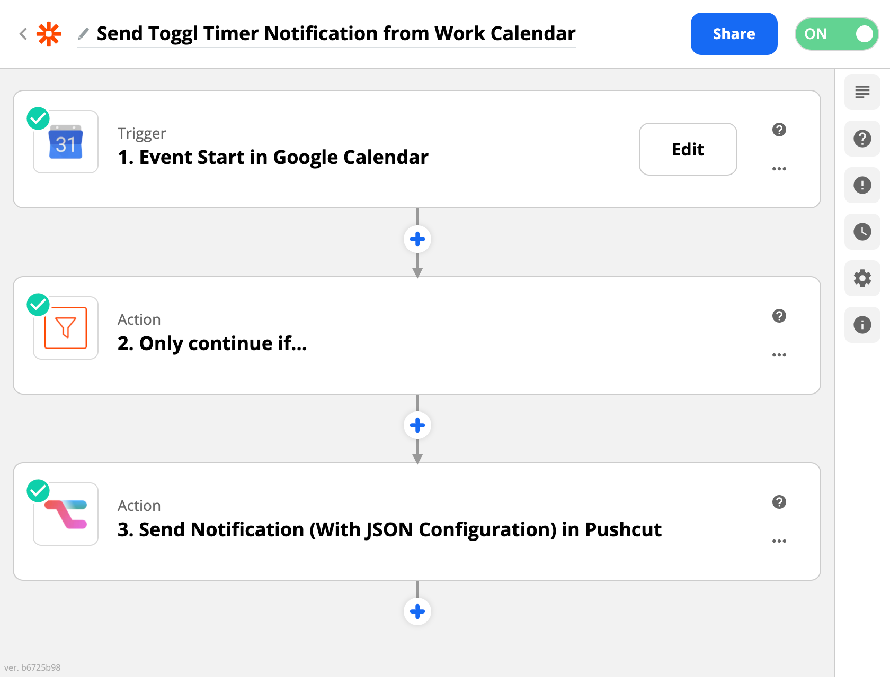
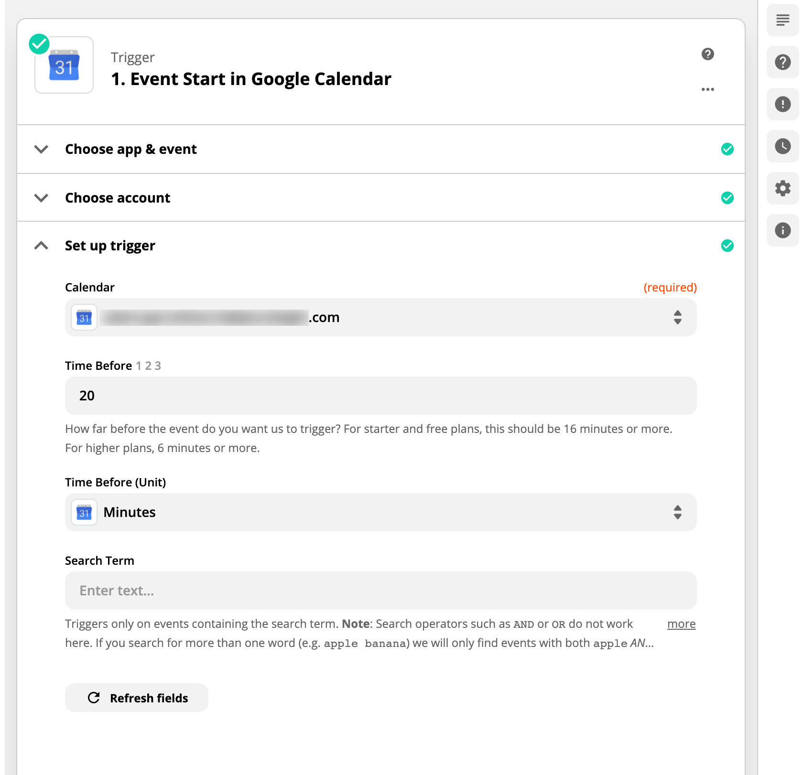
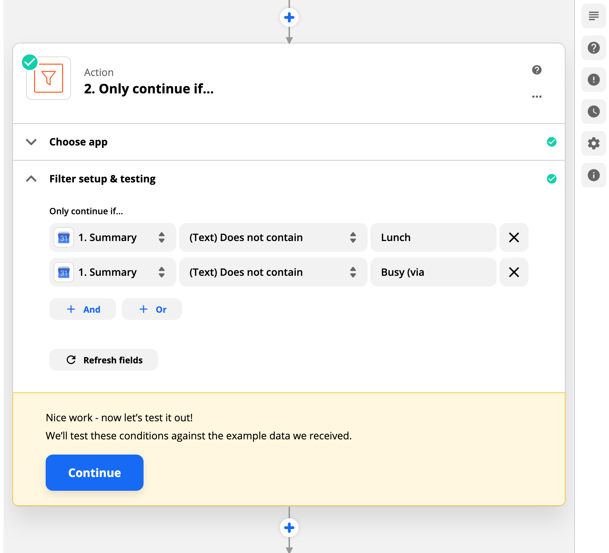
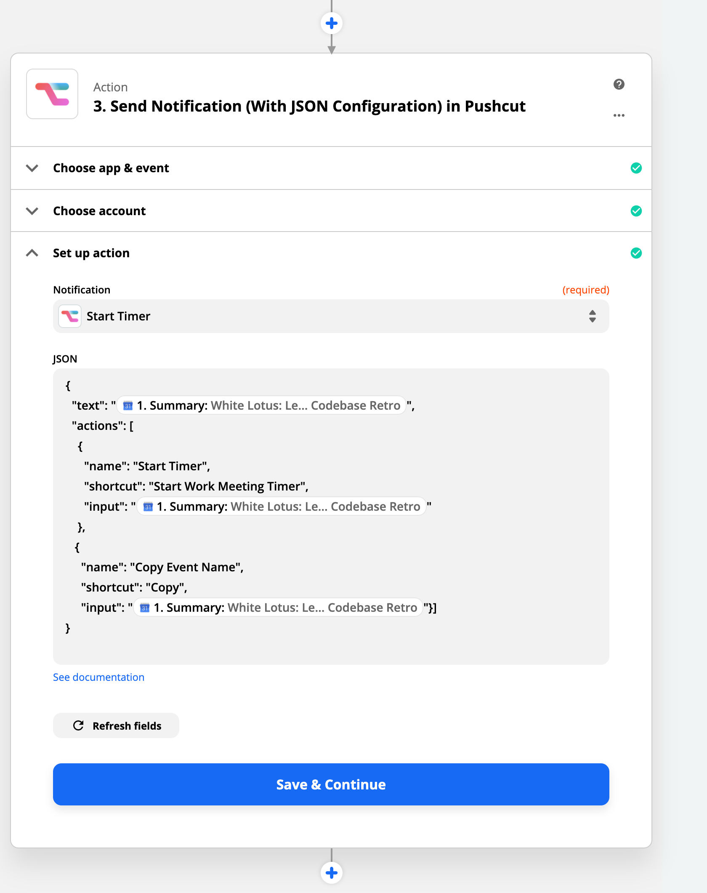
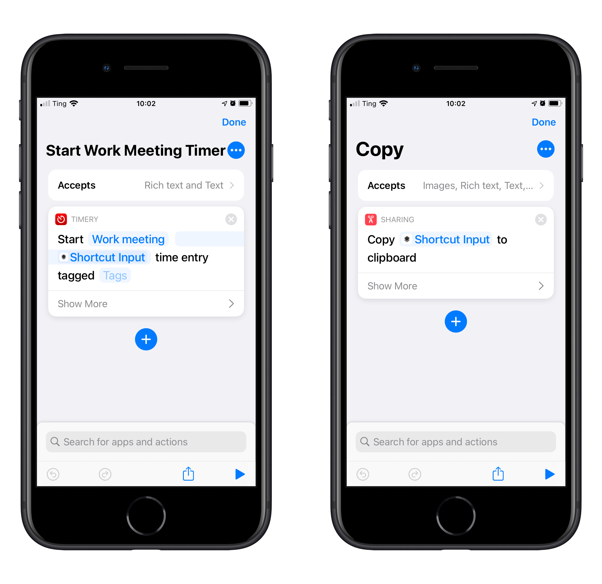

## TLDR

I use Zapier to send myself notifications before each event on my work calendar. From that notification, I can start a timer on Toggl (a time tracking app).

## The tools:

- Google Calendar
- Zapier
- Pushcut
- Shortcuts
- Timery
- Toggl

## Setting It All Up

There are 3 steps involved with this setup: The Zapier zap, the Pushcut notification, and the shortcut.

### The Pushcut Notification

You have to set up this step first, so that it's ready for Zapier.

All you need to do is add a new notification in the app with the name "Start Timer." You don't need to set up any actions. That will be done in Zapier.

### The Zap

[You can install the zap here](https://zapier.com/shared/aaa6ee7918767a7acca9c2e9878888ec5a934272) instead of creating it from scratch.

I made a new zap called "Send Toggl Timer Notification from Work Calendar."

The trigger is "Event Start in Google Calendar." In the "Time Before" field, I put 20 minutes and I usually get the notification about 10-20 minutes before the event starts. This is key because I don't want to get it late.

The next step is a filter because I was getting too many notifications for events where I don't want a timer. You can filter out anything that has the word "Lunch," "OOO," "Appointment," or whatever you want.

The final step sends a notification using Pushcut. I'm sending custom JSON data so that I will have an menu of 2 actions when I long press the notification: one for starting the timer, and another for copying the name of the event. I added the "Copy Event Name" because sometimes I forget to start the timer and I need to copy the event name to start the timer manually in Timery.

In the actions array, I have the name of the action, the name of the shortcut, and the input for the shortcut.

### The Shortcuts

The shortcuts are extremely simple. They both accept text and they both have just one action.

The "Start Work Meeting Timer" shortcut, starts a timer with Timery. The project is "Working Meeting" and the description is the input.

The "Copy shortcut", copies the input.

You can download them here:

- [Start Work Meeting Timer](https://www.icloud.com/shortcuts/808bbfaca0b64275998911e00383e627)
- [Copy](https://www.icloud.com/shortcuts/50e6f594f7e44c5887b34b2367222c36)

The work meeting timer used to be a lot more complicated. I used to have to call the Toggl API and now the Timery shortcuts actions make it so easy.
