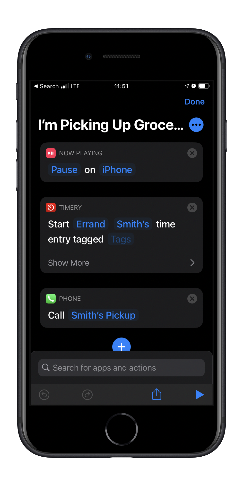
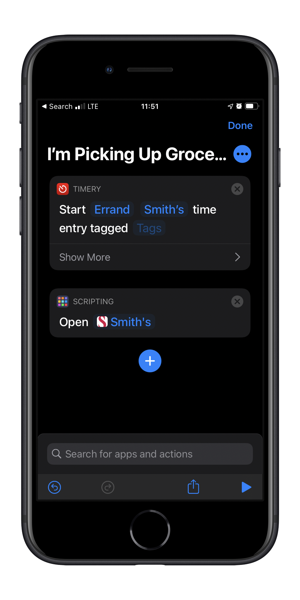

I just updated my shortcut to pick up groceries. I've been using this since I started picking up groceries more when the pandemic started earlier this year. When I arrive, I say "Hey Siri, I'm picking up groceries." It's so convenient, that I think I'll keep doing it in the future.

## Old Version

The shortcut pauses my iPhone (usually a podcast), starts a timer with Timery, and calls the grocery store to let them know I'm there.

## New Version

Now that they added the ability to check-in with the app I don't need to pause my podcast. I changed it to start the timer with Timery and open the grocery store app.
