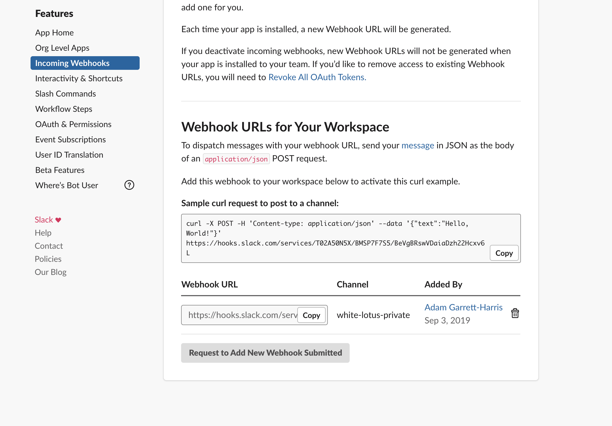

I didn't want Slack installed on my phone as a way of separating work from personal. But I still wanted to be able to send out a quick message to my team to let them know something quickly (usually that I was running late). I also wanted to be able to do this quickly with my voice while I was driving. I wondered if I could do this with Shortcuts and the Slack API. It turns out I could.

I made a bot called Adam Bot (it required approval from a Slack admin at work). Under Permissions, I added the 'Bot Token Scopes' for `chat:write` and `incoming-webhook`. When I made the webhook, I choose my team's private channel as the one to post to. I copied the webhook into a Shortcut and I made 2 Shortcuts:

## Post to Slack

This accepts text as input and if it's run as input, it calls the Slack webhook url with the text, which posts it in my teams channel as the bot.

If it ran without any input, it presents me with a menu of several common things I might want to send as well as an option for "Other", where it will prompt me to type (or dictate) whatever I want my message to be.

You can get the shortcut here:

[Post to Slack](https://www.icloud.com/shortcuts/5101a09157084aff8feccb6a1bfaa87d)

## I'm Late to Work

I made the above shortcut accept text, because I wanted to also make this super simple shortcut, that tells my team I'm running late without any prompts. I just say "I'm late to work", and shortcuts does the rest. As a side note, if you feel the need to use this frequently, it may be a sign that you should rethink your routine...

This shortcut just calls the "Post to Slack" shortcut with the text: "I'm running late to work" as the input.

You can get the shortcut here:

[I'm Late to Work](https://www.icloud.com/shortcuts/a4b98d028c9d428f97f8978e318bd65b)

## Result

In the end, the result is a quick message from the bot version of me in my team's Slack channel.