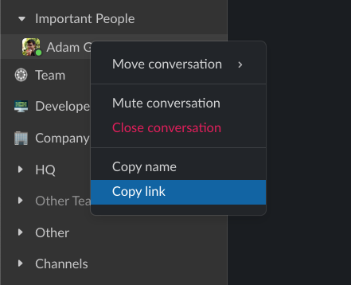
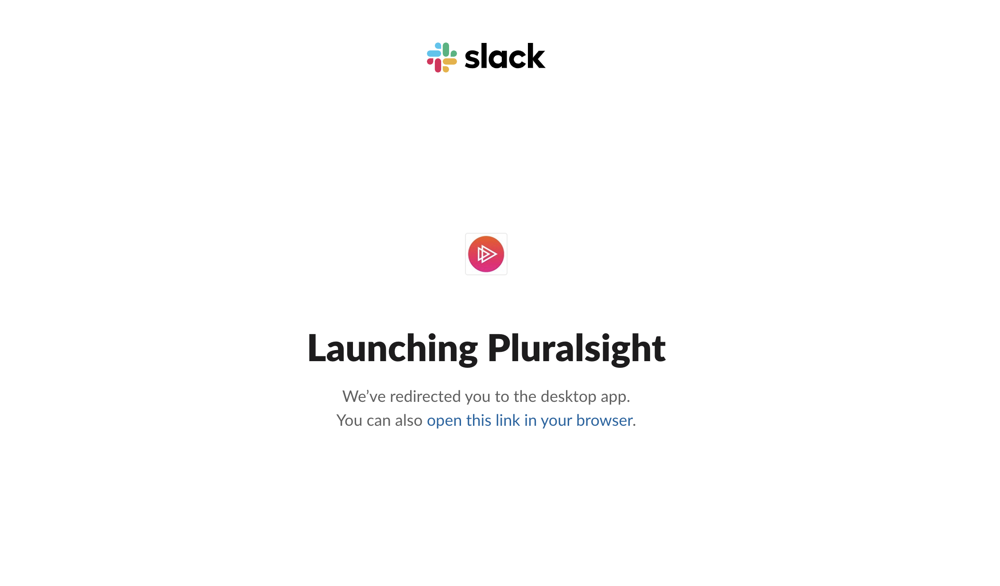
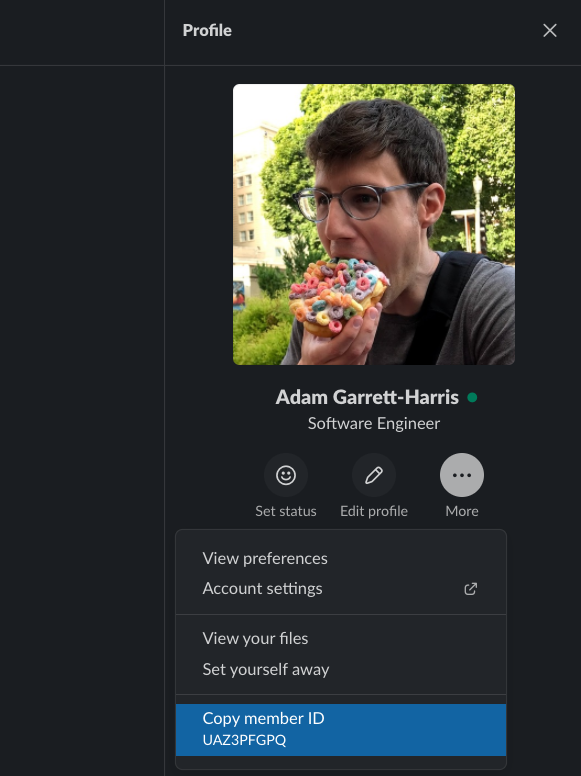

If you want to quickly message someone in Slack, you might think you can get a url to the thread with them by right clicking on your conversation with them and clicking "Copy link", but you actually get a web url like this: `https://pluralsight.slack.com/archives/DAZ89HRHD`. Technically, it works, but it opens up a web browser first, and then jumps to Slack, which is not what I want.

The real url is more like this: `slack://user?team=T02A50N5X&id=UF4683F1B` where the id after `team=` is the team id or workspace id and the id after `id=` is the id of the person.

You can get the workspace id by logging into slack on the web. The url will look something like `https://app.slack.com/client/T02A50N5X/unreads/user_profile/UF4683F1B`. It's the part after `client/`.

You can get the id of the person in the desktop app by viewing the person, clicking the more menu, and clicking "Copy member ID."

After that, you can use the link however you want. I use it in a Keyboard Maestro macro that I can trigger with ⌃⌥⌘S. Since I use the same keyboard shortcut for each person I slack with often, Keyboard Maestro opens up a conflict palette where I then type the first letter of their name. This even works if Slack isn't running.

For me, this is a part of my contextual computing setup that reduces friction and reduces the amount of time from thinking (I need to message so-and-so) to doing because I don't have to think about opening up Slack and getting distracted by all the unread messages and sometimes even forgetting why I opened up Slack.
