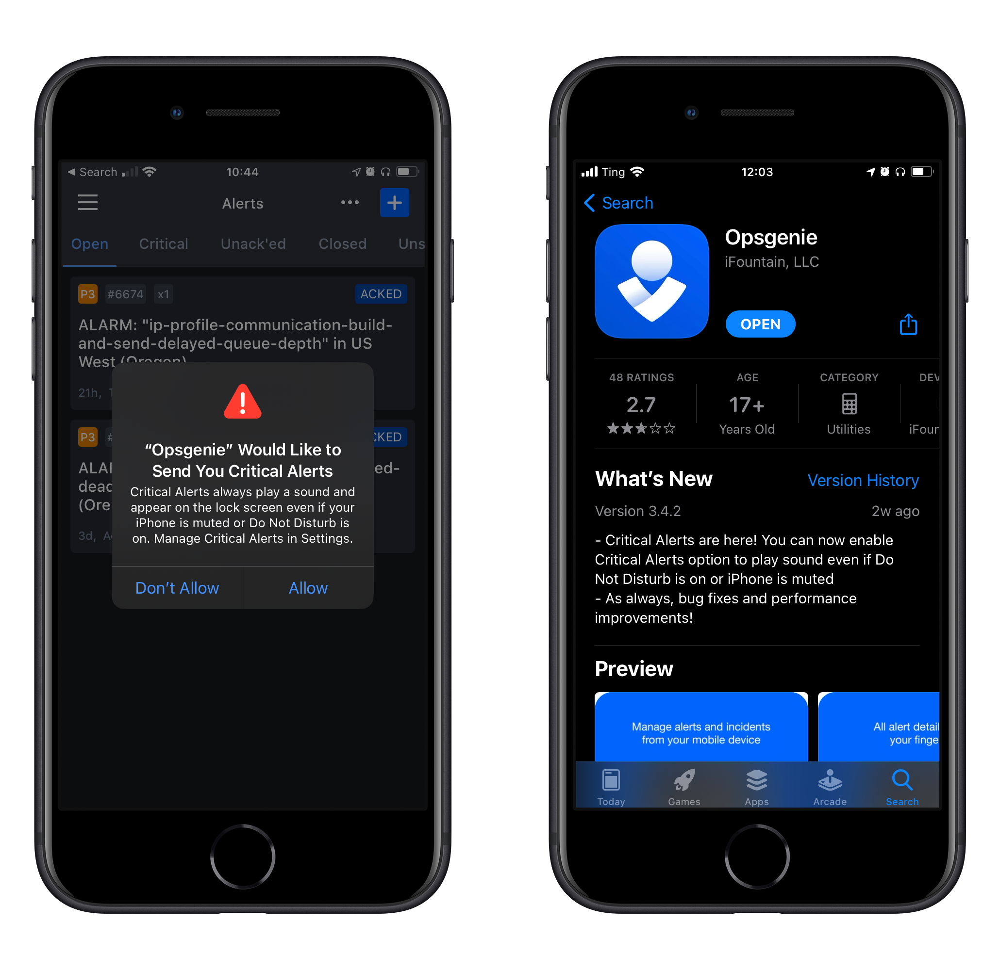
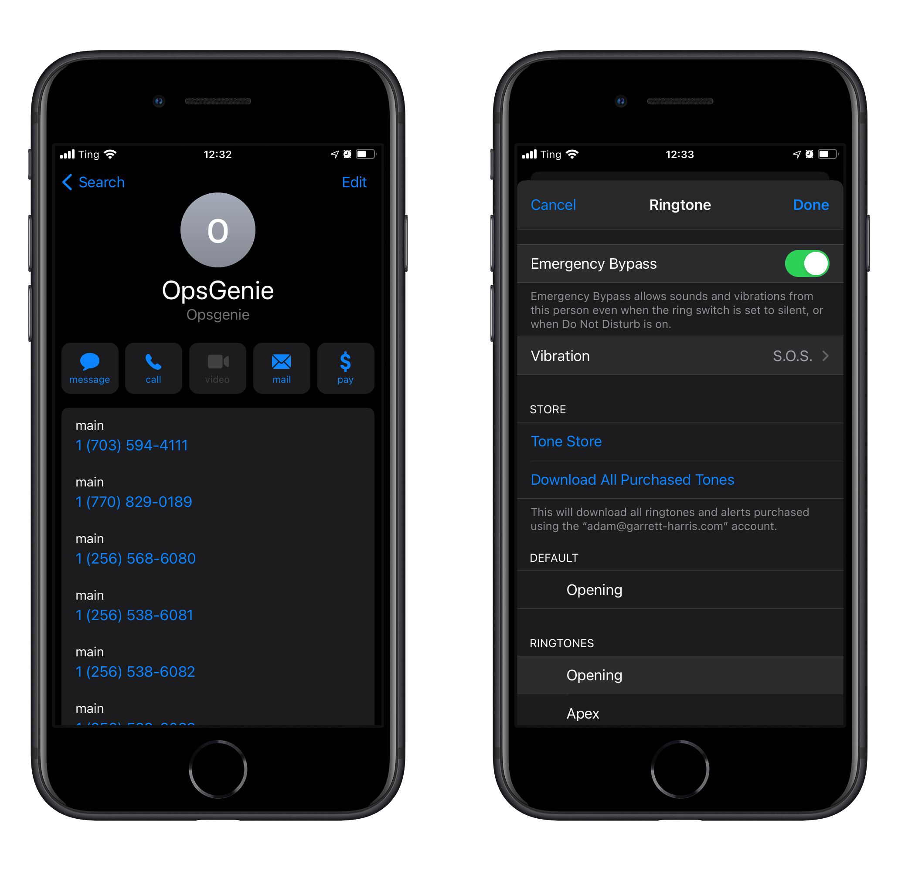
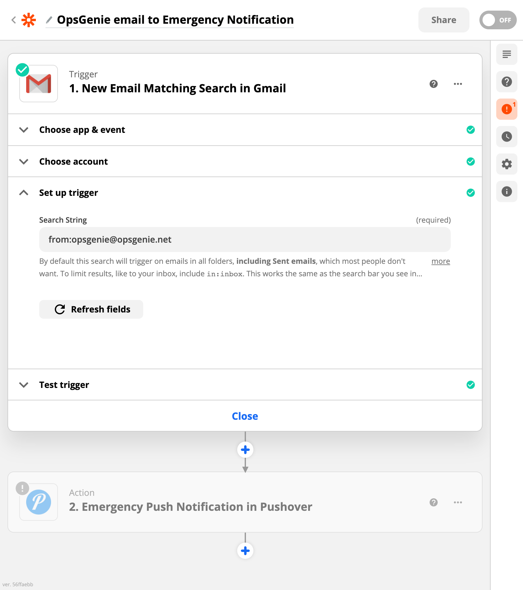
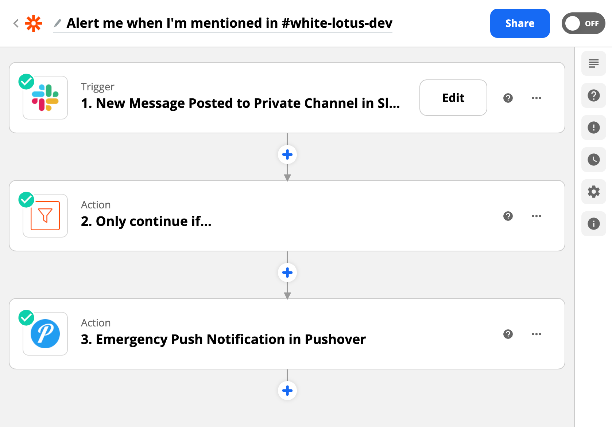
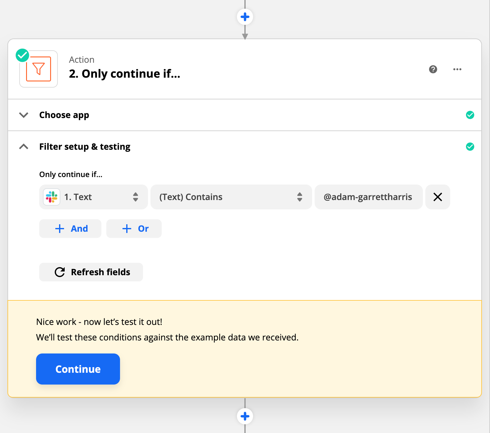
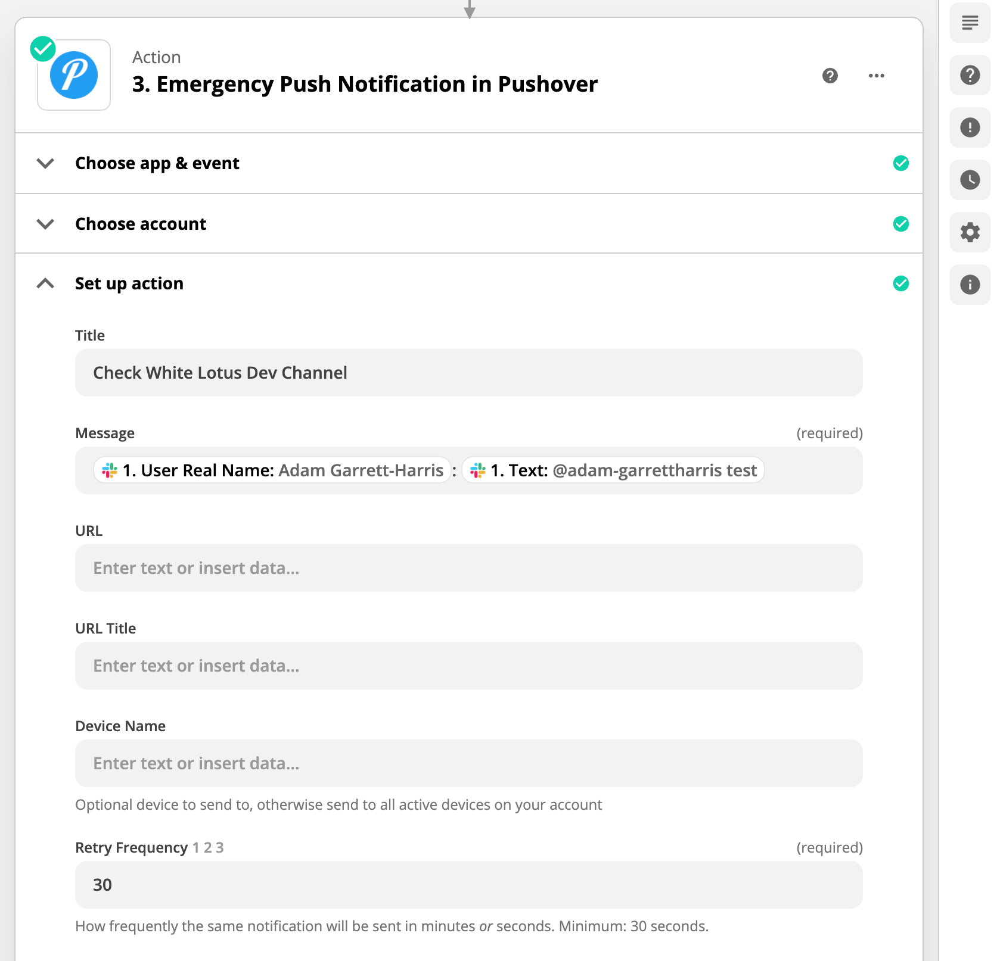
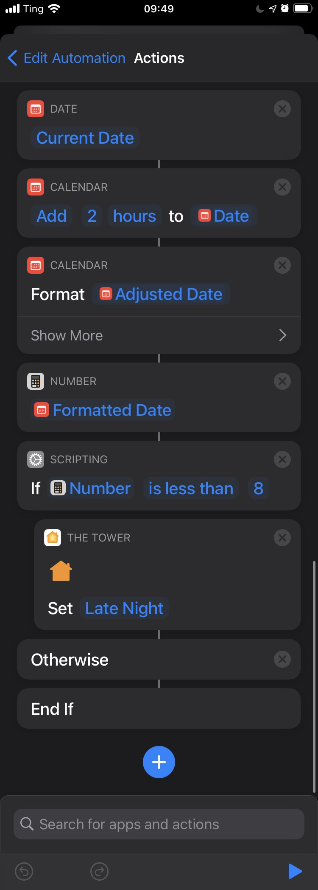

At my job, I am on a rotating schedule to respond to alerts when something is going wrong with our code. We use OpsGenie, which will send me a push notification, a text, an email, a phone call, and if it still can't reach me, it will alert someone else on my team, if they don't respond, then it will alert the DevOps engineer on our team. If I'm asleep with my phone on "Do Not Disturb," which it always is, then I'll miss it, which would be embarrassing and unprofessional. So, I've gone through a lot of effort to make sure this won't happen.

OpsGenie just recently added a feature on iOS that can play a sound even when "Do Not Disturb" is turned on. I don't know much about the new feature, but I still don't think it will wake me up.

Here are the things I've done to make sure I wake up (even though I hate waking up in the middle of the night).

## Add Opsgenie to contacts with Emergency Bypass

I added [all of the phone numbers that Opsgenie uses](https://docs.opsgenie.com/docs/voice-sms-notifications) to a contact. Then, under Ringtone, I turned on "Emergency Bypass," picked an annoying ringtone (Cosmic), and changed the vibration pattern to "S.O.S." Now when I get a call, I can't miss it. Actually, my wife can't miss it. I don't wake up because my phone is ringing, I wake up because my wife is hitting me and telling me that my phone is ringing.

I've also turned on "Emergency Bypass" for everyone on my team, my manager, her manager, and a few other people in DevOps.

## Emails trigger Emergency Alerts

In Zapier, (although you could probably do the same thing in IFTTT) I've set it up to alert me with Pushover anytime I get an email from OpsGenie. Pushover is a service to send yourself push notifications. It has a handy feature called "Emergency alerts". When you receive one of these alerts, it overrides "Do Not Disturb" and it keeps alerting you over and over until tap "Acknowledge."

## Being tagged in Slack triggers Emergency Alert

We have a channel in Slack that's just for developers and usually if someone mentions my name in there it's really important, so I used Zapier to send me an emergency alert if someone mentions my user handle in that channel. I also customized the alert with the name of the person who sent the message and the contents of their message. That way, I can just read it and dismiss it without going to my computer to check Slack.

## Automatically turn on my lamp when I unplug my iPhone at night

One final thing that helped is that I set up an automation with Shortcuts that turns the lamp next to my bed on. It only turns it on to 7% brightness with the color red. I set this up with the Shortcuts automation of "Charger" so that it runs when my phone is disconnected from power. It gets the current date, adds 2 hours, grabs the time portion of that date, and if the number is less than 8, that means it's between 10pm and 6am. it sets a scene in Apple Home.

