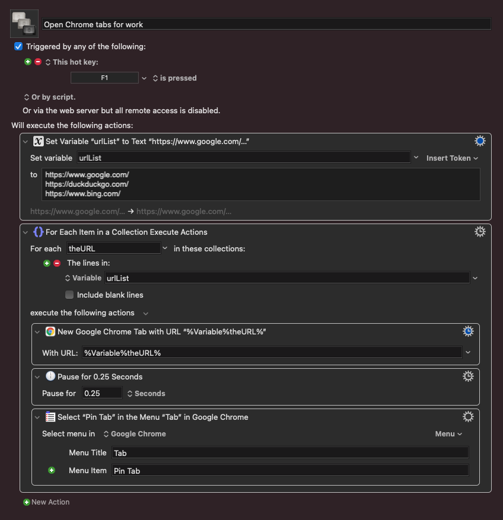

I have a Keyboard Maestro macro that I run at the beginning of almost every workday (if these tabs aren't already open).

It opens a list of urls in Chrome and pins them.

You can download the macro here: [Open Chrome tabs for work](./Open Chrome tabs for work.kmmacros)
