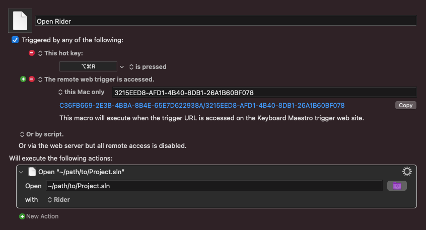
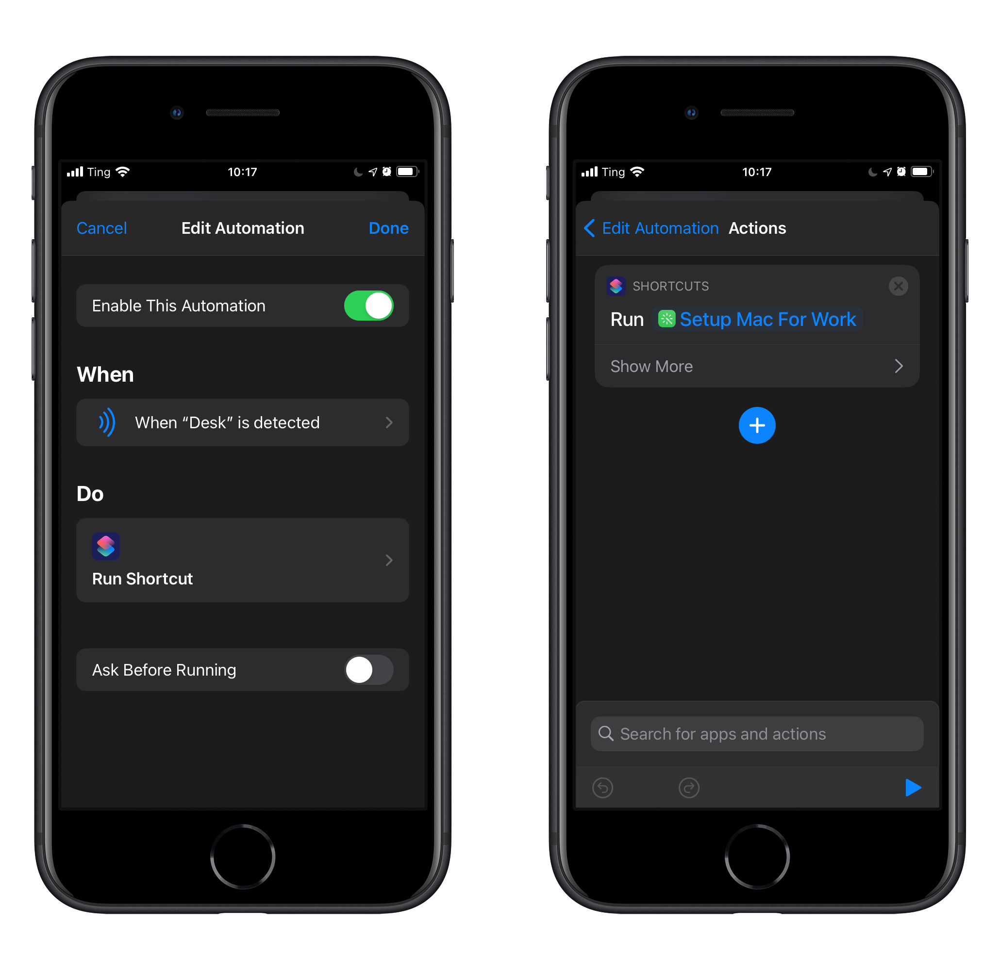

Sometimes the hardest part is just getting started, so I've tried to make it easy to get started with work. I made a Keyboard Maestro macro to open my IDE (Rider) to the correct files. I just have a macro that opens the solution file for our code with Rider.

I can trigger it with a keyboard shortcut (⌥⌘R), but I also added a remote web trigger. I then set up an automation in Shortcuts on my phone to call that url when it senses an NFC sticker, which I put on the corner of my desk.

Now when I'm feeling lazy, but I really need to code, I put my phone on the corner of my desk and watch my computer open up my IDE for me.