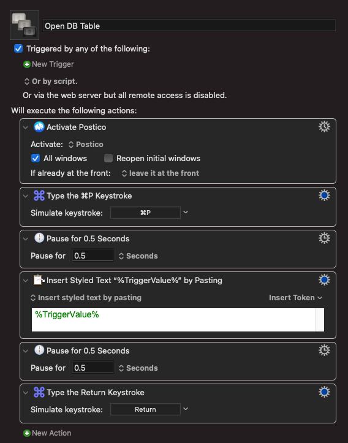

We use Postico for managing our Postgres database at work.

I made a Keyboard Maestro macro called "Open DB Table." It has no trigger. Instead, it needs to be triggered by a url and that url needs to contain a value. In this case the value is the name of the table you want to open.

The macro activates Postico, types ⌘P which is the keyboard shortcut for "Open quickly...", it then types in the trigger value (the name of the table), waits half a second, and then hits the return key.

This only works if Postico is already open and in the right database.

The way I used this is by making a simple web page with a list of links for each table. The links look something like this: `kmtrigger://macro=Open%20DB%20Table&value=Awesome%20People`

You can download the macro here: [Open DB Table macro](./Open%20DB%20Table.kmmacros)