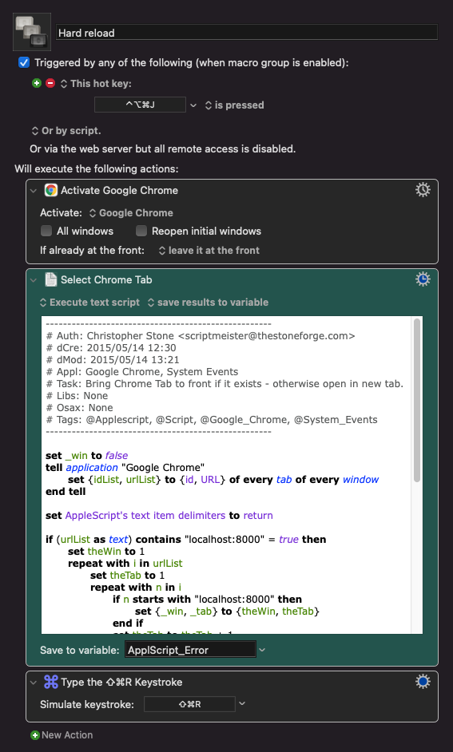

I have a Keyboard Maestro macro where I can hit ⌃⌥⌘J and it will switch to Chrome, switch to the tab where I'm developing, and do a hard refresh. I've found this really useful so that I don't have to hit ⌘Tab to get to Chrome, and then switch to the correct tab and hit ⌘R.

This macro uses some AppleScript and you'll have to change "localhost:8000" that's in there 3 times to whatever url you use for web development. It could probably be improved by using a variable instead. I got the Applescript from a Keyboard Maestro forum at some point and it says it was written by Christopher Stone, so thanks Christopher!



Here is the Applescript:

```applescript
----------------------------------------------------
# Auth: Christopher Stone <scriptmeister@thestoneforge.com>
# dCre: 2015/05/14 12:30
# dMod: 2015/05/14 13:21
# Appl: Google Chrome, System Events
# Task: Bring Chrome Tab to front if it exists - otherwise open in new tab.
# Libs: None
# Osax: None
# Tags: @Applescript, @Script, @Google_Chrome, @System_Events
----------------------------------------------------

set _win to false
tell application "Google Chrome"
	set {idList, urlList} to {id, URL} of every tab of every window
end tell

set AppleScript's text item delimiters to return

if (urlList as text) contains "localhost:8000" = true then
	set theWin to 1
	repeat with i in urlList
		set theTab to 1
		repeat with n in i
			if n starts with "localhost:8000" then
				set {_win, _tab} to {theWin, theTab}
			end if
			set theTab to theTab + 1
		end repeat
		set theWin to theWin + 1
	end repeat
end if

if _win ≠ false then
	tell application "System Events"
		if quit delay ≠ 0 then set quit delay to 0
		tell process "Google Chrome"
			perform action "AXRaise" of window _win
		end tell
	end tell
	tell application "Google Chrome"
		tell front window to set active tab index to _tab
	end tell
else
	tell application "Google Chrome"
		open location "localhost:8000"
	end tell
end if

----------------------------------------------------
```


You can download the macro here [Hard reload macro](./hard-reload.kmmacros)
