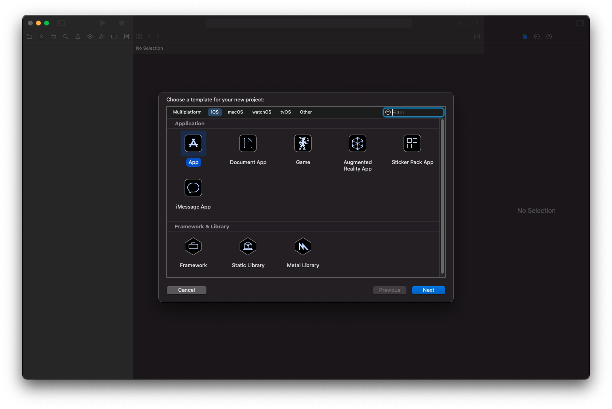
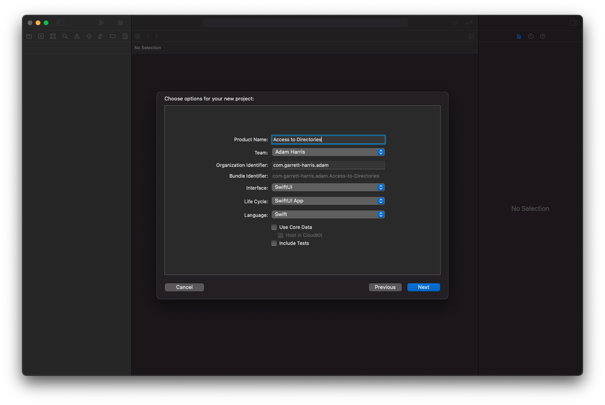
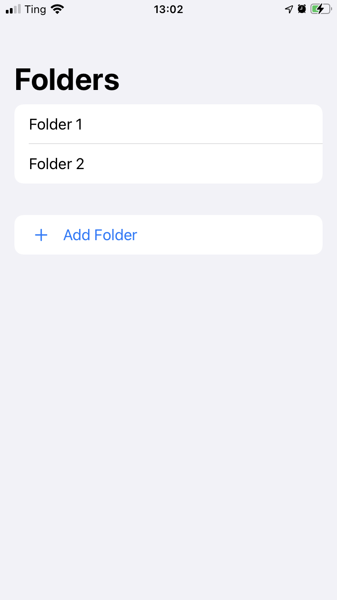
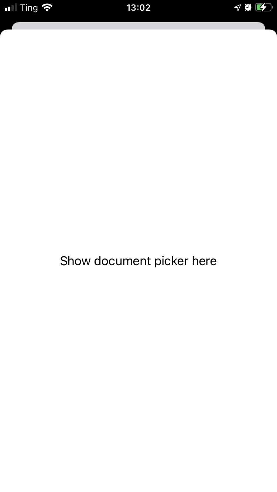
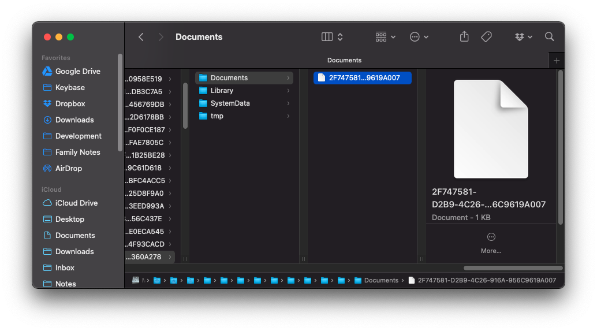

<iframe width="560" height="315" src="https://www.youtube.com/embed/62M2BVR_ISw" title="YouTube video player" frameborder="0" allow="accelerometer; autoplay; clipboard-write; encrypted-media; gyroscope; picture-in-picture" allowfullscreen></iframe>

In iOS 13 and later, apps can access directories that are outside of the app's sandbox. And the app can save a bookmark to that location. In this project we're going to allow the user to select multiple folders and save them using bookmarks.

## Start the Project

Make a new project. I'll call mine called "BookmarkDirectories".





In `ContentView.swift` add some UI to show a list of folders (or directories) and a button to open the document picker so the user can add a new folder to the list. For now, I'll add some dummy data so we can get an idea of what it will look like. And I'll add some placeholder text in the sheet.

```swift
import SwiftUI

struct ContentView: View {
    @State var showFilePicker = false

    var body: some View {
        NavigationView {
            List {
                Section {
                    // TODO: replace this with the list of directories from the bookmarks
                    Text("Folder 1")
                    Text("Folder 2")
                }
            
                Button {
                    showFilePicker = true
                } label: {
                    Label("Add Folder", systemImage: "plus")
                }
                .sheet(isPresented: $showFilePicker) {
                    // TODO: show a document picker here
                    Text("Show document picker here")
                }
            }
            .navigationTitle("Folders")
            .listStyle(InsetGroupedListStyle())
        }
    }
}

struct ContentView_Previews: PreviewProvider {
    static var previews: some View {
        ContentView()
    }
}
```

It should look like this and open a sheet when you tap the button:





## Show the Document Picker

Apple has a documentation page called [Providing Access to Directories](https://developer.apple.com/documentation/uikit/view_controllers/providing_access_to_directories), and it says the framework is UIKit. This is important because there are some things that SwiftUI can't do yet. And according to a video I found on Hacking With Swift called [Wrapping a UIViewController in a SwiftUI view](https://www.hackingwithswift.com/books/ios-swiftui/wrapping-a-uiviewcontroller-in-a-swiftui-view), "...you need to learn to talk to UIKit if you want to add more advanced functionality." The whole video/article is great and worth the watch/read.

He explains that to wrap a UIKit `ViewController` we have to create a struct that conforms to the `UIViewControllerRepresentable` protocol.

On the [UIViewControllerRepresentable](https://developer.apple.com/documentation/swiftui/uiviewcontrollerrepresentable) page, it says "Use a `UIViewControllerRepresentable` instance to create and manage a [`UIViewController`](https://developer.apple.com/documentation/uikit/uiviewcontroller) object in your SwiftUI interface."

So let's do that. Create a new Swift file called `DocumentPicker.swift` and make a struct named `DocumentPicker` that conforms to `UIViewControllerRepresentable`. You also have to import SwiftUI.

```swift
import SwiftUI

struct DocumentPicker: UIViewControllerRepresentable {
}
```

Xcode will say that it doesn't conform. Take its suggestion and let it add the protocol stubs. It will add a line that says `typealias UIViewControllerType = type`. Change the type to `UIDocumentPickerViewController`. Then Xcode will still say that it doesn't conform. Take its suggestion again to add protocol stubs. This time, it will add two methods, `makeUIViewController`, and `updateUIViewController`. Notice that the return type of `makeUIViewController` is `UIDocumentPickerViewController`. Now, you can delete the `typealias` line because Swift can figure out the type from the return type of the function.

```swift
func makeUIViewController(context: Context) -> UIDocumentPickerViewController {
    code
}
    
func updateUIViewController(_ uiViewController: UIDocumentPickerViewController, context: Context) {
    code
}
```

 Delete the "code" placeholder from `updateUIViewController` because, although we have to have this function to conform, we don't need to do anything with it. Inside `makeUIViewController`, we need to add some code to return a `UIDocumentPickerViewController`.
 
 On the [Providing Access to Directories](https://developer.apple.com/documentation/uikit/view_controllers/providing_access_to_directories) article it has this code to ask the user to select a directory.
 
 ```swift
// Create a document picker for directories.
let documentPicker =
    UIDocumentPickerViewController(forOpeningContentTypes: [.folder])
documentPicker.delegate = self

// Set the initial directory.
documentPicker.directoryURL = startingDirectory

// Present the document picker.
present(documentPicker, animated: true, completion: nil)
```
 
But all we need to do is make the `documentPicker` and return it.

```swift
func makeUIViewController(context: Context) -> UIDocumentPickerViewController {
    let documentPicker =
        UIDocumentPickerViewController(forOpeningContentTypes: [.folder])
    return documentPicker
}
```

Now that we have a `DocumentPicker` struct, which is a valid SwiftUI view, you can use it in `ContentView.swift`. Replace the placeholder text in the sheet with `DocumentPicker()`

When you run the app and tap on the button, it should open the document picker, but when you select a folder, it does nothing except dismiss the sheet. This is because we aren't receiving any information about which document the user selected. To do this, we need to use a Coordinator.

## Use a Coordinator to get the selected folder

Back on the [UIViewControllerRepresentable](https://developer.apple.com/documentation/swiftui/uiviewcontrollerrepresentable) page, it says "When you want your view controller to coordinate with other SwiftUI views, you must provide a `Coordinator` instance to facilitate those interactions." And under Topics, there is a section called "Providing a Custom Coordinator Object" that mentions a function called [`makeCoordinator()`](https://developer.apple.com/documentation/swiftui/uiviewcontrollerrepresentable/makecoordinator()-32trb)

Add a `makeCoordinator` method to the `DocumentPicker` struct that returns a `Coordinator`, add a nested `Coordinator` class, and inside `makeUIViewController`, assign the `coordinator` to the `documentPicker.delegate`.

```swift
import SwiftUI

struct DocumentPicker: UIViewControllerRepresentable {
    func makeUIViewController(context: Context) -> UIDocumentPickerViewController {
        let documentPicker =
            UIDocumentPickerViewController(forOpeningContentTypes: [.folder])
        documentPicker.delegate = context.coordinator
        return documentPicker
    }

    func updateUIViewController(_ uiViewController: UIDocumentPickerViewController, context: Context) {

    }
    
    func makeCoordinator() -> Coordinator {
        Coordinator()
    }
    
    class Coordinator: NSObject, UIDocumentPickerDelegate {
        
    }
}
```

Since we are assigning an instance of the `Coordinator` class to the `documentPicker` delegate, it must conform to `UIDocumentPickerDelegate`, and because of that, it must first conform to `NSObject`.

Now we need to make the coordinator actually do something when the user picks a document. On the [UIDocumentPickerDelegate](https://developer.apple.com/documentation/uikit/uidocumentpickerdelegate) page, there is a function called `documentPicker(UIDocumentPickerViewController, didPickDocumentsAt: [URL])`. There is also a deprecated function that returns just one URL instead of an array. Don't accidentally use that one. The easiest way to add this to your code is start typing `didPick`, then select the correct one. For now, add a `print` statement:

```swift
class Coordinator: NSObject, UIDocumentPickerDelegate {
    func documentPicker(_ controller: UIDocumentPickerViewController, didPickDocumentsAt urls: [URL]) {
	    // TODO: save this url to a bookmark
        print(urls[0])
    }
}
```

When you run the app and select a folder, it will print out a URL to the console in Xcode. For example, when I select a folder called "Inbox" in iCloud Drive it looks like this:

```
file:///private/var/mobile/Library/Mobile%20Documents/com~apple~CloudDocs/Inbox/
```

Next, we need to save this URL to a bookmark instead of printing it to the console.

## Save Directory as a Bookmark

What is a bookmark? According to Apple's documentation on [Bookmarks](https://developer.apple.com/documentation/foundation/nsurl#1663783), it's a piece of data that you can convert a security-scoped URL into. You can then convert a bookmark back into a security-scoped URL later. Why not just store the plain URL? Well, a bookmark lets you find the current location of the URL even if the user moves or renames the resource, or if the user relaunches your app or restarts the system.

Let's make a new Swift file called `BookmarkController.swift`. Inside of this file, make a class that conforms to `ObservableObject` so that it can publish an array of URLs for the SwiftUI view to use. We need a property called `urls` that will contain an array of URLs. We will also need a method called `addBookmark`.

```swift
import SwiftUI

class BookmarkController: ObservableObject {
    @Published var urls: [URL] = []	
    
    func addBookmark(for url: URL) {
        // Generate a UUID
        // Convert URL to bookmark
        // Save the bookmark into a file (the name of the file is the UUID)
        // Add the URL to the urls array
    }
}
```

To add this to the environment, go back to `BookmarkDirectoriesApp.swift` and add an instance of this class to the environment:

```swift
import SwiftUI

@main
struct BookmarkDirectoriesApp: App {
    @StateObject var bookmarkController = BookmarkController()
    
    var body: some Scene {
        WindowGroup {
            ContentView()
                .environmentObject(bookmarkController)
        }
    }
}

```

Most of the code we need for the `addBookmark` function is on the [Providing Access to Directories](https://developer.apple.com/documentation/uikit/view_controllers/providing_access_to_directories) page under "Save the URL as a Bookmark", but we need to add a few other things like creating a UUID for the file name, getting the location to save the bookmark, and adding the URL to the `urls` array. When you append the URL to the array, you can wrap that in a `withAnimation` block so that it will animate into the view. We have to import `SwiftUI` because of the `withAnimation` line. The function should look like this now:

```swift
    func addBookmark(for url: URL) {
        do {
            // Start accessing a security-scoped resource.
            guard url.startAccessingSecurityScopedResource() else {
                // Handle the failure here.
                return
            }
            
            // Make sure you release the security-scoped resource when you finish.
            defer { url.stopAccessingSecurityScopedResource() }
            
            // Generate a UUID
            let uuid = UUID().uuidString
            
            // Convert URL to bookmark
            let bookmarkData = try url.bookmarkData(options: .minimalBookmark, includingResourceValuesForKeys: nil, relativeTo: nil)
            // Save the bookmark into a file (the name of the file is the UUID)
            try bookmarkData.write(to: getAppSandboxDirectory().appendingPathComponent(uuid))
            
            // Add the URL and UUID to the urls array
            withAnimation {
                urls.append(url)
            }
        }
        catch {
            // Handle the error here.
            print("Error creating the bookmark")
        }
    }
```

I also added a private helper method to get the app's sandbox directory, which is where we store the bookmark files.

```swift
private func getAppSandboxDirectory() -> URL {
    FileManager.default.urls(for: .documentDirectory, in: .userDomainMask)[0]
}
```

Now in the `DocumentPicker.swift` it can use the `BookmarkController` to save the directory that the user picked. First, add an `@EnvironmentObject` at the top of the struct. Since the nested coordinator class doesn't have access to the `bookmarkController`'s properties we need to give it access. To give it access, make an initializer for the coordinator that takes a `DocumentPicker` as an argument and pass in `self` when making the `Coordinator`. Then, instead of printing the URL, we can call `parent.bookmarkController.addBookmark(for: urls[0])` .

```swift
import SwiftUI

struct DocumentPicker: UIViewControllerRepresentable {
    @EnvironmentObject private var bookmarkController: BookmarkController
    
    func makeUIViewController(context: Context) -> UIDocumentPickerViewController {
        let documentPicker =
            UIDocumentPickerViewController(forOpeningContentTypes: [.folder])
        documentPicker.delegate = context.coordinator
        return documentPicker
    }

    func updateUIViewController(_ uiViewController: UIDocumentPickerViewController, context: Context) {

    }
    
    func makeCoordinator() -> Coordinator {
        Coordinator(self)
    }
    
    class Coordinator: NSObject, UIDocumentPickerDelegate {
        var parent: DocumentPicker
        
        init(_ parent: DocumentPicker) {
            self.parent = parent
        }
		
        func documentPicker(_ controller: UIDocumentPickerViewController, didPickDocumentsAt urls: [URL]) {
            parent.bookmarkController.addBookmark(for: urls[0])
            
        }
    }
}
```

Now when you run the app and select a folder, if you look in the app's sandbox directory (using an app like OpenSim makes this easy), you'll see that it create a file.



You can even open it with a text editor if you want to see the contents of the file. It will have some text that mostly looks like gibberish, but you'll see the URL in there if you look closely.

```
book0$Usersadamgarrett-harrisLibrary	Developer
CoreSimulatorDevices$8FEA2CC9-1C52-4C04-87EF-34E45605C2BFdata
ContainersSharedAppGroup$5042B85C-3783-4F02-B625-3A71D5485089File Provider StorageTEst8 <L`xॿ‘‰Ù @8S˜x˛xk∆l∆m∆QôcRôcÊI´J´ÂK´fiX´∂d´÷ƒÄ8åú¨ºÃ‹Ï¸,<L\A√`‡]fr≠	file:///Macintosh HD - Data† htA¡fiDÄ$635E43C1-455E-453C-8A79-02CE65BDEB55ÖÔ/NSURLDocumentIdentifierKey¸mcfp:/biZXiDYzMIZAUlsolN9EQazrsK9kg4_kfBllhQLgvJM=/com.apple.FileProvider.LocalStorage//fid=209765590¿˛ˇˇˇLlº@¨ t ‹ Ï (    T0 Äp ∏–àĨ
```

## Retrieve Bookmarks

To show the bookmarks to the user, access the `bookmarkController` as an environment variable. Add `@EnvironmentObject var bookmarkController: BookmarkController` to the top of the `ContentView` struct and pass a new `BookmarkController` to the `ContentView` in the preview:

```swift
ContentView()
    .environmentObject(BookmarkController())
```

Then use a `ForEach` to show each url in the list:

```swift
ForEach(bookmarkController.urls, id: \.self) { url in
    Text(url.lastPathComponent)
}
```

When you run the app and add a folder, it will show up in the list, but when you restart the app it won't be there. That's because we're never loading up the existing bookmarks when the app starts. Another problem is that our preview in Xcode now shows zero folders, and I want to be able to preview what it will look like in the app. Let's fix both of those problems.

To load up the existing bookmarks into the `urls` array, we need to write a `loadAllBookarks` function in our `BookmarkController`. It needs to get all the bookmark files from our app's sandbox directory, loop over all of them using `compactMap`, and for each of them, add the URL into the `urls` array.

```swift
func loadAllBookmarks() {
    // Get all the bookmark files
    // Map over the bookmark files
        // Get the URL from each bookmark
        // Return URL
}
```

On the [Providing Access to Directories](https://developer.apple.com/documentation/uikit/view_controllers/providing_access_to_directories) page, it has a code snippet for getting the URL from a bookmark:

```swift
do {
    let bookmarkData = try Data(contentsOf: getMyURLForBookmark())
    var isStale = false
    let url = try URL(resolvingBookmarkData: bookmarkData, bookmarkDataIsStale: &isStale)
    
    guard !isStale else {
        // Handle stale data here.
        return
    }
    
    // Use the URL here.
}
catch let error {
    // Handle the error here.
}
```

We can use this code inside a `compactMap()`:

```swift
func loadAllBookmarks() {
    // Get all the bookmark files
    let files = try? FileManager.default.contentsOfDirectory(at: getAppSandboxDirectory(), includingPropertiesForKeys: nil)
    // Map over the bookmark files
    self.urls = files?.compactMap { file in
        do {
            let bookmarkData = try Data(contentsOf: file)
            var isStale = false
            // Get the URL from each bookmark
            let url = try URL(resolvingBookmarkData: bookmarkData, bookmarkDataIsStale: &isStale)
            
            guard !isStale else {
                // Handle stale data here.
                return nil
            }
            
            // Return URL
            return url
        }
        catch let error {
            // Handle the error here.
            print(error)
            return nil
        }
    } ?? []
}
```

To call this function when the app starts, let's call it in the `BookmarkController`'s initializer.

```swift
init() {
    loadAllBookmarks()
}
```

That works great, but it doesn't help with our preview. We can add a parameter with a default value to optionally load some dummy data for the preview:

```swift
init(loadFakeData: Bool = false) {
    if loadFakeData {
        urls = [
            URL(string: "some/path/Notes")!,
            URL(string: "some/path/Family%20Notes")!,
        ]
    } else {
        loadAllBookmarks()
    }
}
```

Then in the `ContentView` preview code, you can have one preview with fake data and one without.

```swift
struct ContentView_Previews: PreviewProvider {
    static var previews: some View {
        ContentView()
            .environmentObject(BookmarkController(loadFakeData: true))
        
        ContentView()
            .environmentObject(BookmarkController())
    }
}
```

When you open the app, it will load up the existing bookmarks and you can add more. A big thanks to my friend Elaine who helped me figure all of this out.

Next time, I'll show you how to delete bookmarks and how to show their contents when you tap on one.