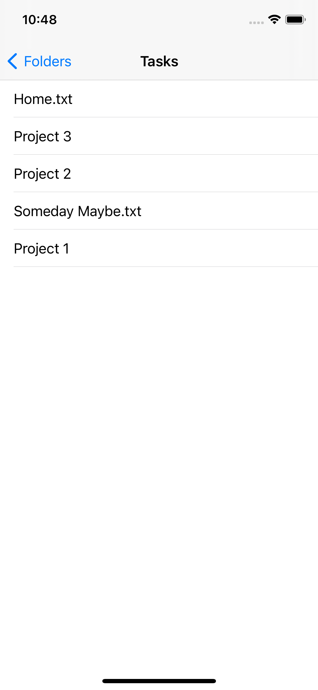
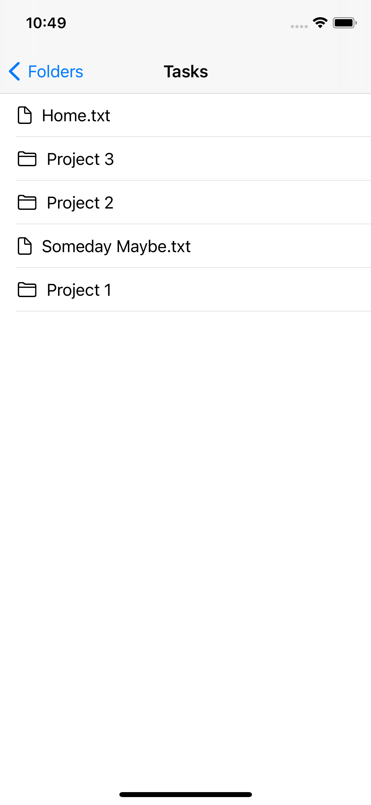

<iframe width="560" height="315" src="https://www.youtube.com/embed/kQL3NawzQ0M" title="YouTube video player" frameborder="0" allow="accelerometer; autoplay; clipboard-write; encrypted-media; gyroscope; picture-in-picture" allowfullscreen></iframe>

[Last time](/2021-08-23-deleting-bookmarks-in-ios/) we made an app that allows the user to select multiple folders and save them using bookmarks. It displays those bookmarks in a list. And the user can delete them from the list by swiping. Now, let's make it a bit more interesting by showing the user the contents of the folder when they tap on it. And we'll show an icon depending on whether it's a folder or a file.

## Make the DetailView

First, let's make the view that will display the details of a folder. Make a new SwiftUI view called `DetailView.swift` that takes in a URL. Add a list with a `NavigationTitle`. To show the navigation title in the preview, wrap `DetailView` in a `NavigationView` in the previews.

```swift
import SwiftUI

struct DetailView: View {
    var url: URL
	// TODO: get the files in the directory
    
    var body: some View {
        List {
            // TODO: loop over the actual files here
            Text("Work")
            Text("Personal")
            Text("Home")
        }
        .navigationTitle(url.lastPathComponent)
        .navigationBarTitleDisplayMode(.inline)
    }
}

struct DetailView_Previews: PreviewProvider {
    static var previews: some View {
        NavigationView {
            DetailView(url: URL(string: "path/to/Notes")!)
        }
    }
}
```

## Make a FileController

We need to get all the files in this directory, so let's make a file called `FileController.swift` with a function called `getContentsOfDirectory` that takes in a URL and returns an array of URLs.

```swift
import Foundation

class FileController: ObservableObject {
    func getContentsOfDirectory(url: URL) -> [URL] {
        do {
            return try FileManager.default.contentsOfDirectory(at: url, includingPropertiesForKeys: nil)
        } catch {
            print(error)
            return []
        }
    }
}
```

To add this to the environment, go back to `BookmarkDirectoriesApp.swift` and add an instance of this class to the environment just like we did with the `BookmarkController` earlier:

```swift
import SwiftUI

@main
struct BookmarkDirectoriesApp: App {
    @StateObject var bookmarkController = BookmarkController()
    @StateObject var fileController = FileController()
    
    var body: some Scene {
        WindowGroup {
            ContentView()
                .environmentObject(bookmarkController)
                .environmentObject(fileController)
        }
    }
}
```

Now, in `DetailView.swift`, we can use the `FileController` by adding it as an environment object. To call the `FileController`'s method everytime this view loads, we can call it with `onAppear()`. We can save the results of this in a state variable called `urls`. Then you can show the actual files in the list.

```swift
import SwiftUI

struct DetailView: View {
    var url: URL
    @State var urls: [URL] = []
    @EnvironmentObject var fileController: FileController
    
    var body: some View {
        List {
            ForEach(urls, id: \.self) { url in
                Text(url.lastPathComponent)
            }
        }
        .onAppear {
            urls = fileController.getContentsOfDirectory(url: url)
            print(urls)
        }
        .navigationTitle(url.lastPathComponent)      
        .navigationBarTitleDisplayMode(.inline)
    }
}

struct DetailView_Previews: PreviewProvider {
    static var previews: some View {
        NavigationView {
            DetailView(url: URL(string: "path/to/Notes")!)
			    .environmentObject(FileController())
        }
    }
}
```

## Add Navigation Links

Now we can link to the detail view from `ContentView.swift`:

Instead of showing `Text` in the list, use a `NavigationLink`.

```swift
ForEach(bookmarkController.bookmarks, id: \.uuid) { uuid, url in
    NavigationLink(url.lastPathComponent, destination: DetailView(url: url))
}
```

Now, when you run the app and tap on a folder, it will show you the files and folders inside that folder. Nice!



## Add icons

But before we call this done, I would like to add a little folder icon next to each folder and a document icon next to each document. If you look at the documentation for [`contentsOfDirectory(at:includingPropertiesForKeys:options:)`](https://developer.apple.com/documentation/foundation/filemanager/1413768-contentsofdirectory), it says that the `keys` parameter lets you specify what kind of information you want about each URL. That sounds exactly like what I want. It takes an array of `URLResourceKey`s. Looking at the page on [URLResourceKey](https://developer.apple.com/documentation/foundation/urlresourcekey)]s, if you search for "directory", you'll find a key called `isDirectoryKey`.

So let's modify our `getContentsOfDirectory()` method to return an array of tuples so that we have a URL and a boolean telling us if it's a directory or not:

```swift
func getContentsOfDirectory(url: URL) -> [(url: URL, isDirectory: Bool)] {
    if isPreview {
       return [
            (URL(string: "Notes/Books")!, false),
            (URL(string: "Notes/Home")!, true)
       ]
    }
    
    do {
        let urls = try FileManager.default.contentsOfDirectory(at: url, includingPropertiesForKeys: [.isDirectoryKey])
        return urls.map({ url -> (url: URL, isDirectory: Bool) in
            do {
                let resourceValues = try url.resourceValues(forKeys: [.isDirectoryKey])
                return (url, resourceValues.isDirectory!)
            } catch {
                return (url, false)
            }
        })
    } catch {
        print(error)
        return []
    }
}
```

In `DetailView.swift` change our state variable from `urls` to `items` and change the type to match the return type from the function.

```swift
@State var items: [(url: URL, isDirectory: Bool)] = []
```

And change the `ForEach` to show either a folder or a document icon next to each name.

```swift
ForEach(items, id: \.url) { item in
    HStack {
        item.isDirectory
            ? Image(systemName: "folder")
            : Image(systemName: "doc")
        Text(item.url.lastPathComponent)
    }
}
```

When you run the app and tap on the folder, we now have icons next to each item showing whether it's a folder or a file.



## Fix the preview

The preview in Xcode looks empty because the function returns an empty array. Let's add a flag in the `FileController`'s initializer that lets it know that we're in preview mode so it can give us some example data.
	
```swift
var isPreview: Bool
    
init(isPreview: Bool = false) {
    self.isPreview = isPreview
}
```

And at the top of `getContentsOfDirectory`, add some code to return example data if `isPreview` is true.

```swift
if isPreview {
   return [
        (URL(string: "Notes/Books")!, false),
        (URL(string: "Notes/Home.md")!, true)
   ]
}
```

In `DetailView.swift` change the preview code to pass true to `isPreview`.

```swift
struct DetailView_Previews: PreviewProvider {
    static var previews: some View {
        NavigationView {
            DetailView(url: URL(string: "path/to/Notes")!)
                .environmentObject(FileController(isPreview: true))
        }
    }
}
```

The [final code for this step can be found on GitHub](https://github.com/agarrharr/BookmarkDirectories/tree/300ff5071572d08f0cb485050e368b33dcdcea23/BookmarkDirectories).