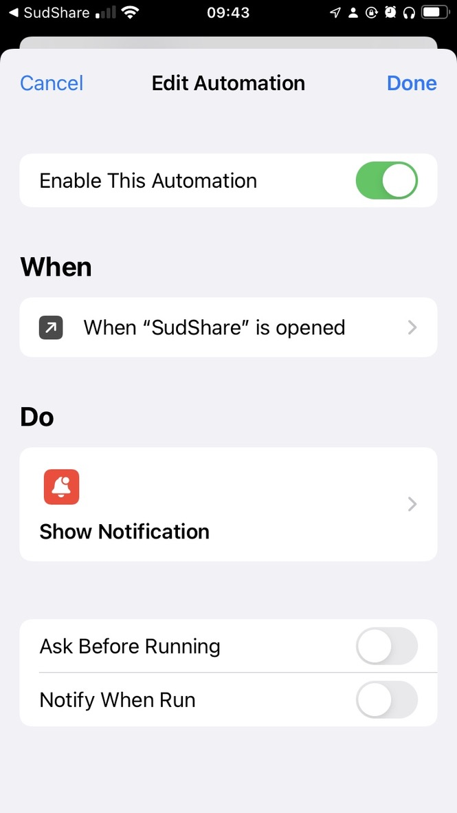
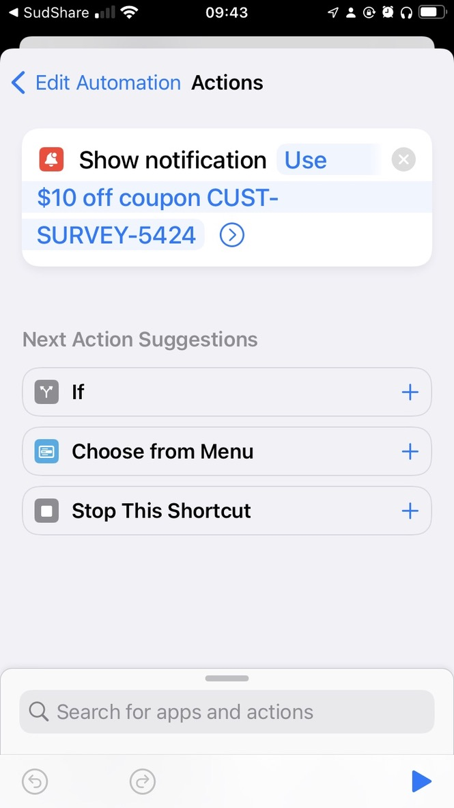
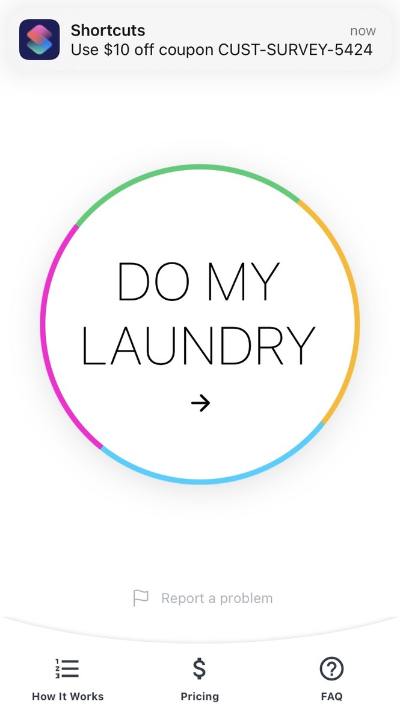

# Using Shortcuts Automations To Remind Me of Coupon Codes

I use an app called SudShare to do my laundry. I got an email from them the other day with a coupon code. I knew I would never remember to use it when I went to prepare my laundry and put in an order. So I made a temporary automation in Shorcuts. It shows me a notification reminding me to use the coupon code whenever I open the SudShare app.

It worked, the next time I opened the app, I saw the code and used it. Then I just had to go and delete the automation.

