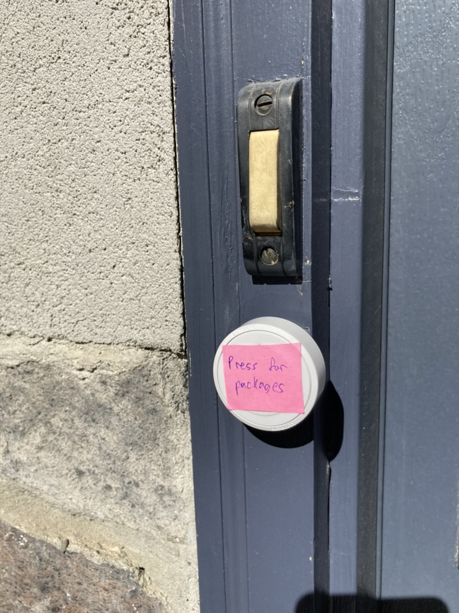
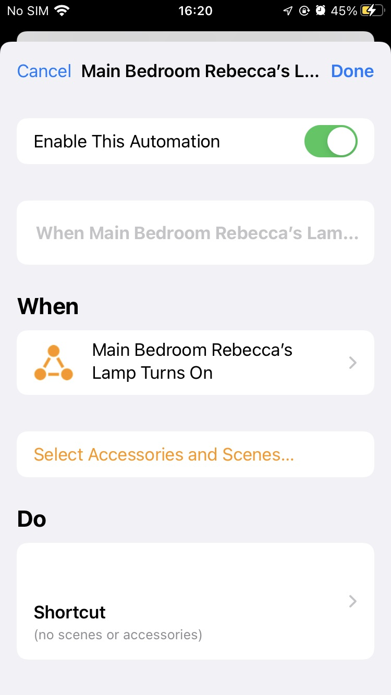
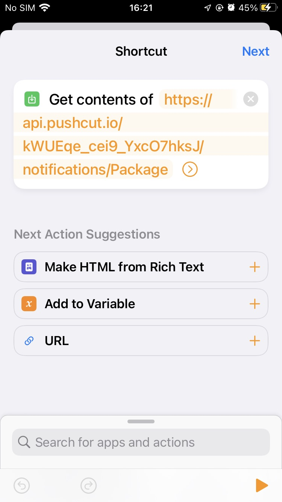
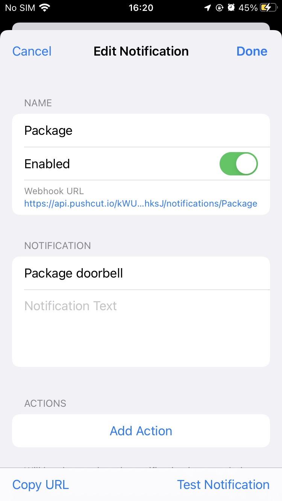
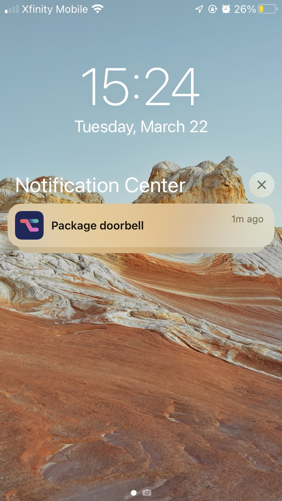

# Using a Home Automation Trigger as an Improvised Doorbell for Deliveries

Today I was expecting my new iPhone to arrive, but the delivery requires a signature and I live in a basement where I can't hear the doorbell, so I made an improvised doorbell. I took my [Lutron Aurora Smart Bulb Dimmer](https://www.amazon.com/gp/product/B07Z6RFQ35) that controls my wife's lamp and I stuck it by the doorbell with [ Gorilla Double Sided Mounting Tape](https://www.amazon.com/Gorilla-Tough-Double-Mounting-Inches/dp/B00OXVG9FW) with a note that said "Press for packages." Then I put the lamp next to my desk.

But I thought I might not see the lamp turn on or off. I wanted to get a notification when someone pressed the button, so I set up a Home Automation in the Shortcuts app that runs when the lamp turns on as well as an identical automation when the lamp turns off. The automation has one action that calls a url.

That url is a webhook that sends me a notification with Pushcut.

Then, when the package arrived, the delivery person pressed the button and I got this notification and I ran outside, excited to not miss my delivery!

