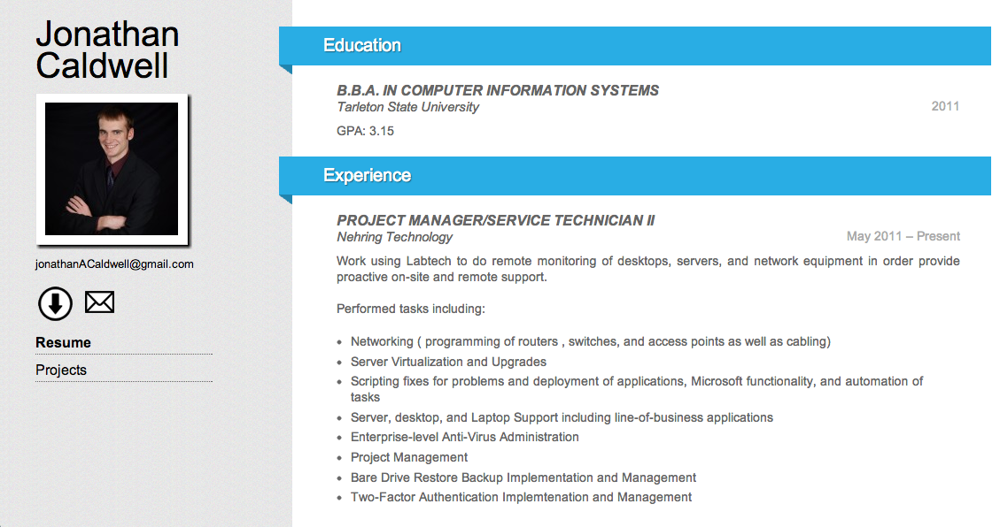
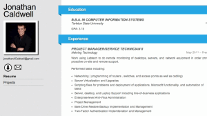
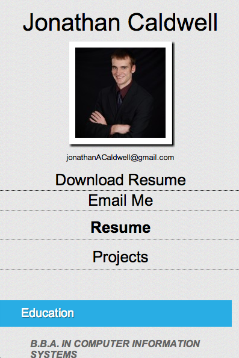

This is a responsive site that I made for my best friend. Since the whole point of the website is to display his resume, I decided to use the WP Resume plugin, which give a nice and easy way of entering and displaying resume data.

I made a child theme based on a theme called Esquire, because it had the scrolling effect I was looking for where the right side of the page scrolls while the left side stays put.

When you resize the window or view it on a smartphone, it switches to a single-column layout and the scrolling is normal. Also, the download and email links become text instead of icons.

<a href="http://www.jonathancaldwell.me/" target="_blank">Live site</a>
