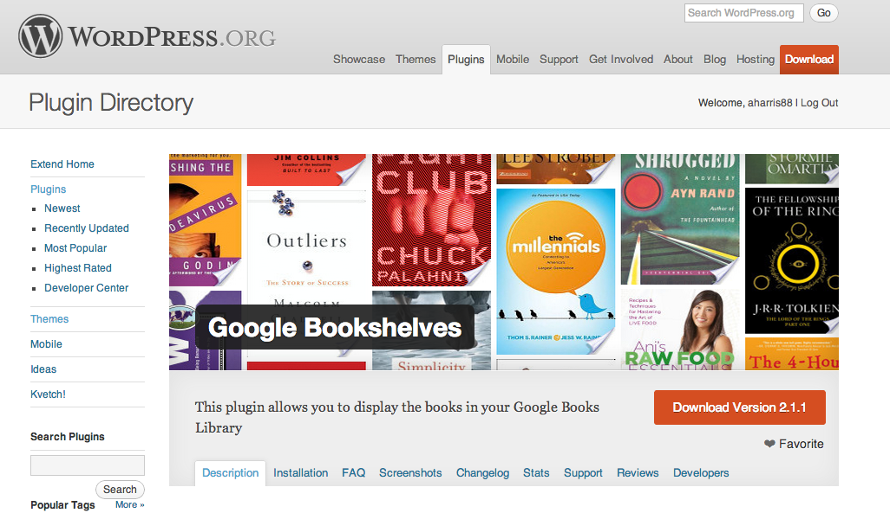
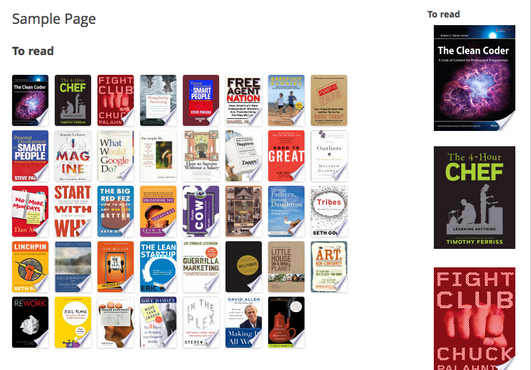

After I made the Starbucks plugin, I realized that I keep track of all of my books that I'm reading in Google Books, but there wasn't a Wordpress plugin to display them, <a href="http://wordpress.org/extend/plugins/google-bookshelves/" target="_blank">so I made one</a>.

It uses the Google API to fetch the books off of your shelves in Google Books. And the best part is that you don't even have to purchase books from Google to use it. Just get a Google account and you can start adding any books to your shelves to keep track of which books you're reading, have read, want to read, or whatever.

You could even keep track of the books that you loaned to people that you'll probably never see again.

The possibilites are endless. Enjoy.

