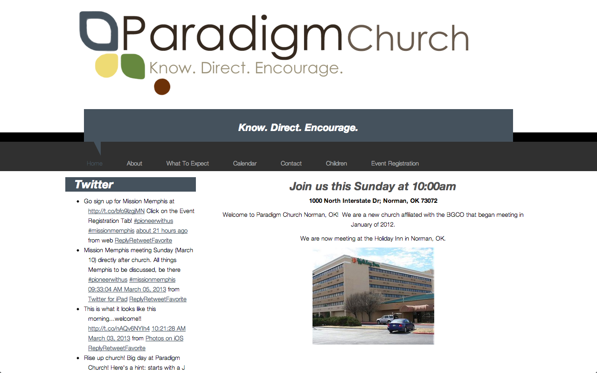
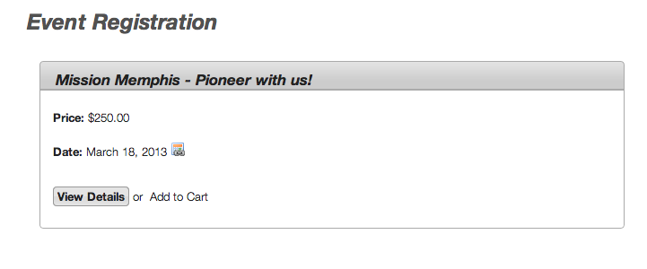
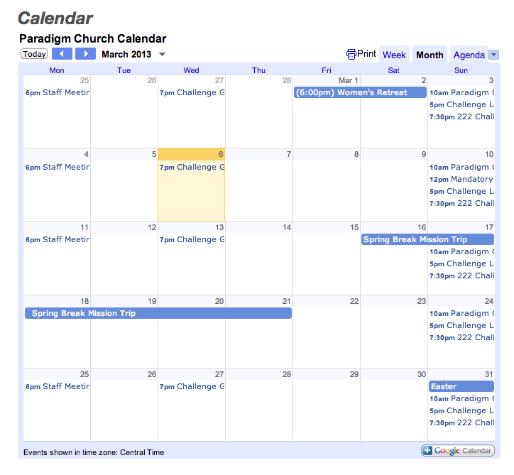

When my good friend, Nick Cooper at Paradigm Church in Norman Ok, asked me to make him a smartphone app, I said yes, because I've always wanted to make an app. But I also said that I should redo their website so that the website would be more mobile friendly and also, so the app could pull info from the site.

He wanted the website up as quickly as possible, so that I could get the app made. So I used a variation on the same theme I used for <a href="http://adamwadeharris.com/the-church-at-round-rock/">The Church at Round Rock</a> called Simple Church.

It has an event registration feature using <a href="http://eventespresso.com/">Event Espresso</a>, and the Calendar is an embedded Google Calendar.

<a href="http://paradigmchurch.com" target="_blank">Live site</a>
