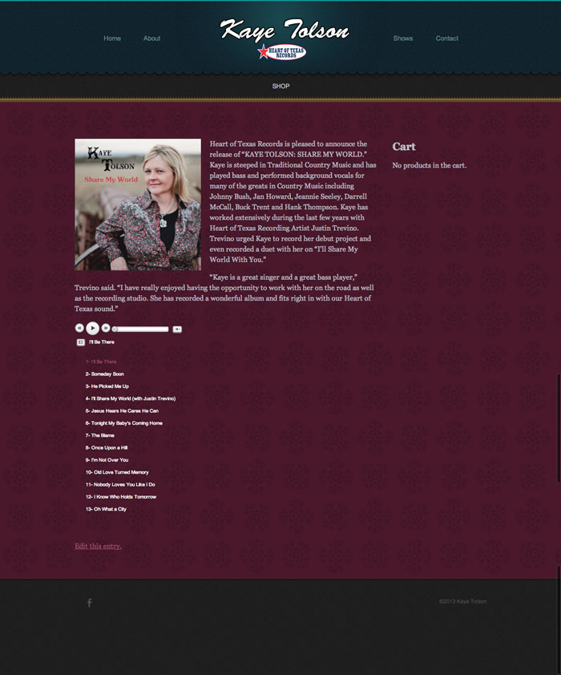

I had the opportunity to put together a site for Kaye Tolson, a local musician from my hometown of Stephenville Texas. It was a lot of fun to work with her, and to help her start selling her albums online! It has clips from her latest album "Share My World" on the homepage, a page of her upcoming shows, and a shopping cart to sell her CDs.

I used a free website template from <a href="http://www.freewebsitetemplates.com/" target="_blank">http://www.freewebsitetemplates.com/</a> called <a href="http://www.freewebsitetemplates.com/preview/vinylrecordshopwebtemplate/" target="_blank">Vinyl Record Shop</a>. I modified it and turned it into a Wordpress theme. The Vinyl Record Shop theme is the property of Free Website Templates. I also used the following plugins: <a href="http://codecanyon.net/item/ultimate-dj-manager-wordpress-plugin/241072" target="_blank">Ultimate DJ Manager</a> for the music clips, <a href="http://wordpress.org/plugins/gigpress/" target="_blank">GigPress</a> for the shows page, and <a href="http://wordpress.org/plugins/jigoshop/" target="_blank">Jigoshop</a> for the shopping cart.

<a href="http://www.kayetolson.com" target="_blank">Live site</a>
