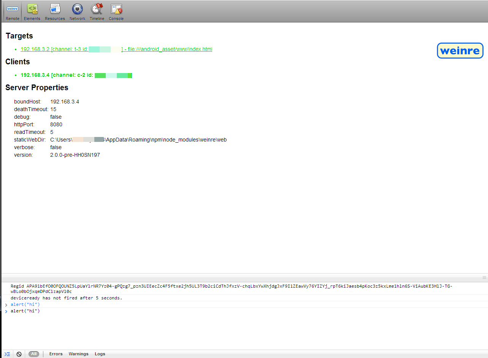

**Update**- There is now an easier way to debug android apps in android Kit Kat (4.4.2) without needing to use weinre ([Remote Debugging in Phonegap with Chrome Devtools](../remote-debugging-in-phonegap-with-chrome-devtools))

I finally figured out how to setup remote debugging in Phonegap, or any html for that matter. I've banged my head against the wall more than a few times trying to tweak some css, javascript, or local database storage, and this would have saved me a lot of time and effort.

With this setup, you'll be able to install a phonegap app onto any device (provided it's on the same network as your computer) and inspect elements, run javascript commands from your computer, and view localstorage and databases.

## Weinre setup

Weinre is the tool that you'll need for this. It's pronounced winery and is now owned by Apache. It stands for WEb INspector REmote.

Make sure you have [node](http://nodejs.org/) installed, which you probably already do if you're running phonegap. You can run `npm -v` to check your version. Then install weinre with node:

```bash
npm -g install weinre
```

You might have to run it with `sudo` at the beginning of the command on macOs or GNU/Linus. Then figure out your ip address with the `ipconfig` command (or `ifconfig` on macOs). On macOs an easier way to find your IP Address is `ipconfig getifaddr en1` if you are on wifi or `ipconfig getifaddr en0` if you are plugged into ethernet.

Once you know your ip address, put this in your `index.html`. Just replace the ip address with your own, and replace everything after the pound sign with whatever you want.

```html
<script src="http://192.168.1.2:8080/target/target-script-min.js#testingmyapp"></script>
```

Put this in `config.xml`. This is important so that this url is whitelisted and the app is allowed to call that url.

```xml
<access origin="http://192.168.1.2:8080/*" />
```

Since this is just for testing and you don't want this code in production, don't accidentally push this code to a public repository. Even if just other developers are using the code, their ip address won't be the same. And if it accidentally gets pushed into production, this could slow down your app.

Then start up weinre. You can specify more options like `--httpPort [portNumber]`. You can check all those options out if you want by running `weinre --help`.

```bash
weinre --boundHost 192.168.1.2
```

Then, in your browser, go to: <a href="http://192.168.1.2:8080/client/#testingmyapp" target="_blank">http://192.168.1.2:8080/client/#testingmyapp</a>



Build the code on your phone or in an emulator and make sure your device is on the same network as your computer.

It's pretty similar to Chrome Dev Tools, and in the Remote tab it gives a list of all targets connected. You can select one and it will turn green, then you can open up any of the other tabs and do things like view console.log messages, run js commands, inspect elements, change css styles (double-click to add or change the css), view localStorage and databases, run database queries, etc.

If you're having trouble inspecting elements that are injected with ajax, refresh the page (on your computer) and then it should be there.

There are also more advanced features of Chrome Developer tools that you can't turn use such as javascript breakpoints, but overall, it's a very useful tool.

Oh, and if you have multiple devices connected at the same time and can't figure out which one is which, just try running this in the javascript console and you'll figure it out pretty quick:

```js
alert("hi")
```
