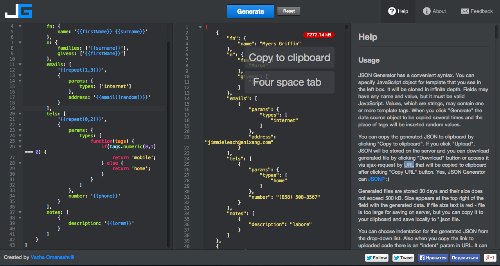

I needed to get a large number of fake contacts onto an iPhone recently for testing purposes, but I couldn't find any example data that I could download. So here's what I did to create it.

To find out what some sample data looked like, I went to iCloud and did an export of some contacts. It exports and imports using the vcard format. Here is some example data:

```bash
BEGIN:VCARD\r\nVERSION:3.0\r\nFN:Bob Smith\r\nN:Smith;Bob;;;\r\nEMAIL;TYPE=INTERNET:smith.bob@gmail.com\r\nURL:http\://www.bobsmith.com\r\nEND:VCARD\r\nBEGIN:VCARD\r\nVERSION:3.0\r\nFN:Bob Smith\r\nN:Smith;Bob;;;\r\nEMAIL;TYPE=INTERNET:smith.bob@gmail.com\r\nEMAIL;TYPE=INTERNET:absmith@yahoo.com\r\nEMAIL;TYPE=INTERNET:sillyemail.everyone.has.one643@gmail.com\r\nTEL;TYPE=CELL:123-456-1234\r\nitem1.URL:http\://www.bobsmith.com\r\nitem1.X-ABLabel:PROFILE\r\nitem2.URL:http\://www.bobsmith.com\r\nitem2.X-ABLabel:PROFILE\r\nNOTE:Herein lies a note about Bob Smith
```


Ok, now I knew what the data needed to look like, I just needed to generate it.

I found [json-generator](http://www.json-generator.com/), which can generate random data. The problem was that it only generates json data.

Thankfully, I found [vcard-json](https://github.com/andrewppace/vcard-json) that can convert json to vcard and vcard to json.

So I converted our sample vcard data to json and it looked something like this:

```json
{
  "version":"3.0",
  "fn":{
    "name":"Bob Smith"
  },
  "n":{
    "families":[
      "Smith"
    ],
    "givens":[
      "Bob"
    ]
  },
  "emails":[
    {
      "params":{
        "types":[
          "internet"
        ]
      },
      "address":"smith.bob@gmail.com"
    },
    {
      "params":{
        "types":[
          "internet"
        ]
      },
      "address":"smith.bob@gmail.com"
    },
    {
      "params":{
        "types":[
          "internet"
        ]
      },
      "address":"absmith@yahoo.com"
    },
    {
      "params":{
        "types":[
          "internet"
        ]
      },
      "address":"sillyemail.everyone.has.one643@gmail.com"
    }
  ],
  "urls":[
    {
      "uri":"http\://www.bobsmith.com"
    },
    {
      "group":"item1",
      "uri":"http\://www.bobsmith.com"
    },
    {
      "group":"item2",
      "uri":"http\://www.bobsmith.com"
    }
  ],
  "tels":[
    {
      "params":{
        "types":[
          "cell"
        ]
      },
      "number":"123-456-1234"
    }
  ],
  "notes":[
    {
      "description":"Herein lies a note about Bob Smith"
    }
  ]
}
```

Now I just needed to generate a bunch of data like this. So here was the template I came up for generating the data:

```js
[
    '{{repeat(20000)}}',
    {
        version: '3.0',
        fn: {
            name: '{{firstName}} {{surname}}'
        },
        n: {
            families: ['{{surname}}'],
            givens: ['{{firstName}}']
        },
        emails: [
            '{{repeat(1,3)}}',
            {
                params: {
                    types: ['internet']
                },
                address: '{{email([random])}}'
            }
        ],
        tels: [
            '{{repeat(0,2)}}',
            {
                params: {
                    types: [
                        function(tags) {
                            if(tags.numeric(0,1) === 0) {
                                return 'mobile';
                            } else {
                                return 'home';
                            }
                        }
                    ]
                },
                number: '{{phone}}'
            }
        ],
        notes: [
            {
                description: '{{lorem}}'
            }
        ]
    }
]
```



And this is a sample of the data it generated:


```js
[
    {
        "version": "3.0",
        "fn": {
            "name": "Kim Harper"
        },
        "n": {
            "families": [
                "Hyde"
            ],
            "givens": [
                "Stokes"
            ]
        },
        "emails": [
            {
                "params": {
                    "types": [
                        "internet"
                    ]
                },
                "address": "junecrane@furnitech.com"
            }
        ],
        "tels": [
            {
                "params": {
                    "types": [
                        "home"
                    ]
                },
                "number": "(854) 473-2833"
            },
            {
                "params": {
                    "types": [
                        "home"
                    ]
                },
                "number": "(883) 482-3894"
            }
        ],
        "notes": [
            {
                "description": "eu"
            }
        ]
    },
    {
        "version": "3.0",
        "fn": {
            "name": "George Wall"
        },
        "n": {
            "families": [
                "Allison"
            ],
            "givens": [
                "Christian"
            ]
        },
        "emails": [
            {
                "params": {
                    "types": [
                        "internet"
                    ]
                },
                "address": "knightmedina@gushkool.com"
            },
            {
                "params": {
                    "types": [
                        "internet"
                    ]
                },
                "address": "barkerharmon@orbean.com"
            },
            {
                "params": {
                    "types": [
                        "internet"
                    ]
                },
                "address": "terrynorton@netbook.com"
            }
        ],
        "tels": [
            {
                "params": {
                    "types": [
                        "home"
                    ]
                },
                "number": "(951) 498-2926"
            },
            {
                "params": {
                    "types": [
                        "home"
                    ]
                },
                "number": "(829) 455-2780"
            }
        ],
        "notes": [
            {
                "description": "laboris"
            }
        ]
    }
]
```

Now that I had all that json data, I used [vcard-json](https://github.com/andrewppace/vcard-json) to convert it to vcard format. Here is a sample of the output:

```bash
BEGIN:VCARD
VERSION:3.0
FN:Kim Harper
N:Hyde;Stokes;;;
EMAIL;TYPE=INTERNET:junecrane@furnitech.com
TEL;TYPE=HOME:(854) 473-2833
TEL;TYPE=HOME:(883) 482-3894
NOTE:eu
END:VCARD
BEGIN:VCARD
VERSION:3.0
FN:George Wall
N:Allison;Christian;;;
EMAIL;TYPE=INTERNET:knightmedina@gushkool.com
EMAIL;TYPE=INTERNET:barkerharmon@orbean.com
EMAIL;TYPE=INTERNET:terrynorton@netbook.com
TEL;TYPE=HOME:(951) 498-2926
TEL;TYPE=HOME:(829) 455-2780
NOTE:laboris
END:VCARD
```

So, now all I had to do was go to icloud.com and import all 20,000 contacts, and they started showing up on the iPhone pretty soon.

Here is the [final vcard with 20,000 contacts for download](./contacts.vcf). Feel free to download and use it yourself.
