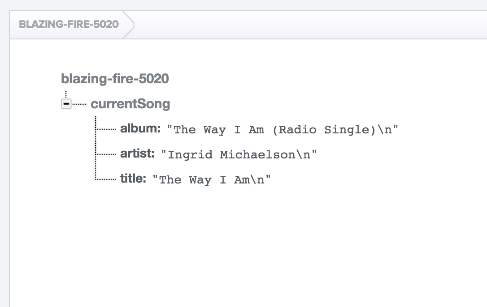

I've been using [pianobar](http://6xq.net/projects/pianobar/) for a while now to listen to Pandora in the command line. I've also been experimenting with [Firebase](https://www.firebase.com/) to make real-time apps.

So I thought it would be cool to add a widget to my blog to show what song I'm listening to with pianobar in real-time.

Here's how I did it!

First, pianobar lets you create a config file with various settings. In this file I put:

```bash
event_command = /Users/adamharris/.config/pianobar/eventcmd.rb
```

This then lets me create a ruby file that will execute based on various hooks that pianobar has. In my eventcmd.rb file I have:

```ruby
#!/usr/bin/ruby

require 'cgi'

trigger = ARGV.shift

if trigger == 'songstart'
  songinfo = {}
  STDIN.each_line { |line| songinfo.store(*line.chomp.split('=', 2))}

  File.open('/Users/adamharris/.config/pianobar/nowplaying', 'w') do |f2|
    f2.puts "#{songinfo['artist']}\n#{songinfo['album']}\n#{songinfo['title']}"
  end

  system("ruby ~/.config/pianobar/pianobarFirebase.rb")
end
```

In this file, I save the title, artist, and album every time a song starts, then I run another ruby file, `pianobarFirebase.rb`. The reason I save it to a file is because I also have another ruby script that can display the current file in a notification popup based on this file.

So here's the contents of `pianobarFirebase.rb`:


```ruby
#!/usr/bin/ruby

require 'cgi'
require 'firebase'

title = ""
artist = ""
album = ""

flag = ARGV[0]

counter = 1
file = File.new('/Users/adamharris/.config/pianobar/nowplaying', 'r')
while (line = file.gets)
  if counter == 1
    artist = line
  end
  if counter == 2
    album = line
  end
  if counter == 3
    title = line
  end
  counter = counter + 1
end

base_uri = 'https://blazing-fire-5020.firebaseio.com/'
secret_key = ''
firebase = Firebase::Client.new(base_uri, secret_key)
firebase.set("currentSong", { :artist => artist, :title => title, :album => album})
```

This file includes a library called firebase. You can get it [here](https://github.com/oscardelben/firebase-ruby) and you can install it by running:

```bash
gem install ruby
```

`pianobarFirebase` reads the `nowplaying` file from earlier and writes it to my firebase database, which is set to read-only, so I need to use the secret-key, which I've deleted from the code here.

So then my firebase looks like this:



So, on my website, I just add this code to get the info from firebase and listening for when it changes.

```html
<div class="widget">
	<h3>Currently Listening To</h3>
	<div id="pianobar">
		<div id="pianobarSong"></div>
		<div id="pianobarArtist"></div>
		<div id="pianobarAlbum"></div>
	</div>
</div>
<script>
	var ref = new Firebase("https://blazing-fire-5020.firebaseio.com/currentSong");
	ref.on("value", function(snapshot) {
		$('#pianobarSong').text(snapshot.val().title);
		$('#pianobarArtist').text(snapshot.val().artist);
		$('#pianobarAlbum').text(snapshot.val().album);
	}, function (errorObject) {
		console.warn("The read from firebase failed: " + errorObject.code);
	});
</script>
```

And here is the end result:


The cool thing is that the website is immediately updated as soon as the song changes, but it doesn't have to constantly check to see if it's changed. Firebase just tells it.

**Update**- I no longer have this on my site.
