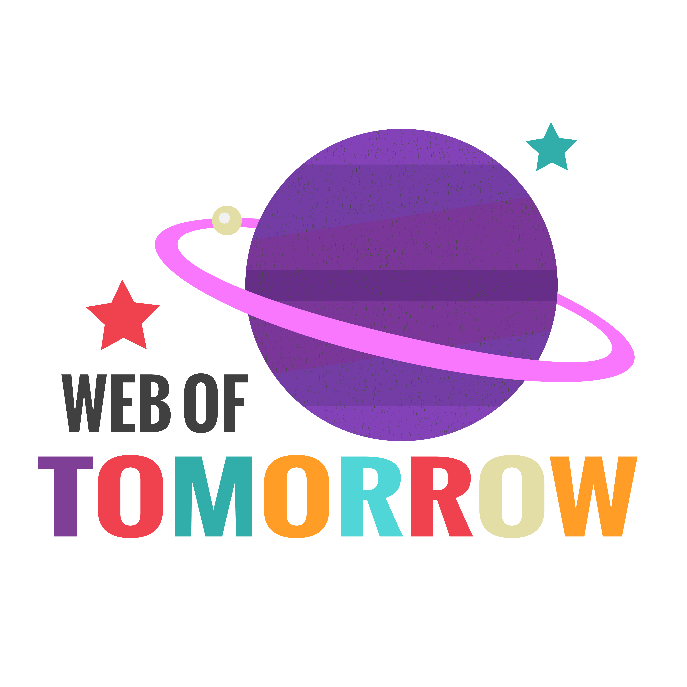

I recently started a podcast about web development for beginners. I teamed up with my friend [Riley Carrasquillo](https://twitter.com/portoreekan), who is new to programming and web development. Each week we take on new topics about web development and web design and talk about it in an easy to understand way. And then we also point people to other resources that they can check out.

We also plan on bringing on guests, because we obviously aren't experts on everything (or anything). Check out our [website](http://www.weboftomorrowpodcast.com/) and subscribe on [iTunes](https://itunes.apple.com/us/podcast/web-of-tomorrow/id1033636563) (or your podcast app of choice).
