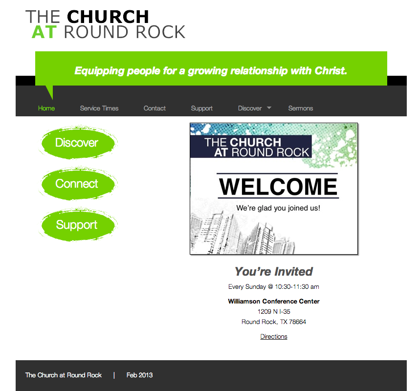
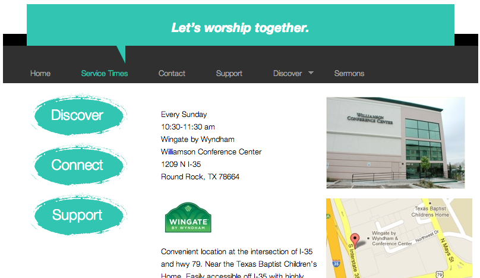
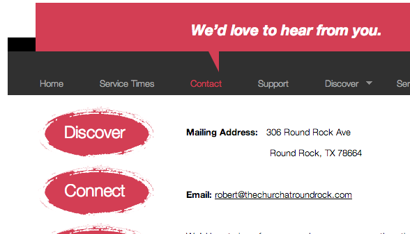
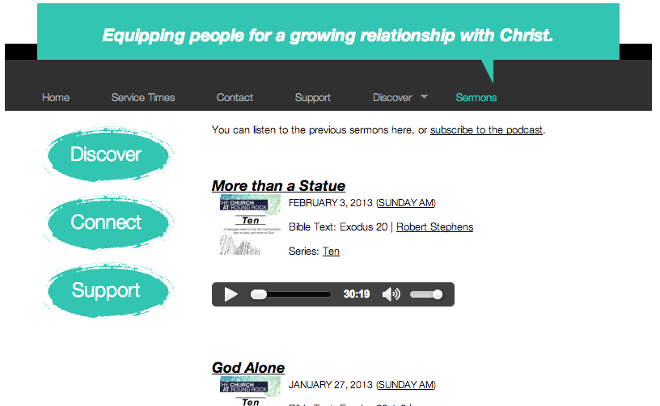

My friend Robert Stephens just started a church plant in Round Rock. When I found out, I really wanted to lend my services and help out with his site. I took their current site, which was made on a mac in iWeb I believe, and converted it to a custom Wordpress theme, which I called Simple Church.

The thing that I really like about it is that every page has a different color and a different tagline.

Since he wanted to upload the sermons on the site, the <a href="http://wordpress.org/extend/plugins/sermon-manager-for-wordpress/" target="_blank">WP Sermon Manager plugin was perfect</a>. It lists out sermons with a shortcode, and also makes a podcast. You can also put a video from youtube or vimeo with each sermon. I would recommend this plugin to any church that wants any easy way to manage a podcast of their sermons.

<a href="http://www.thechurchatroundrock.com/" target="_blank">Live site</a>
