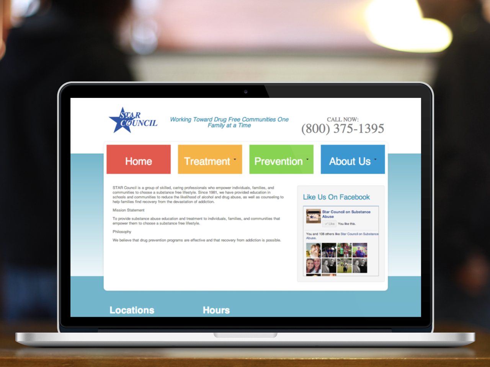
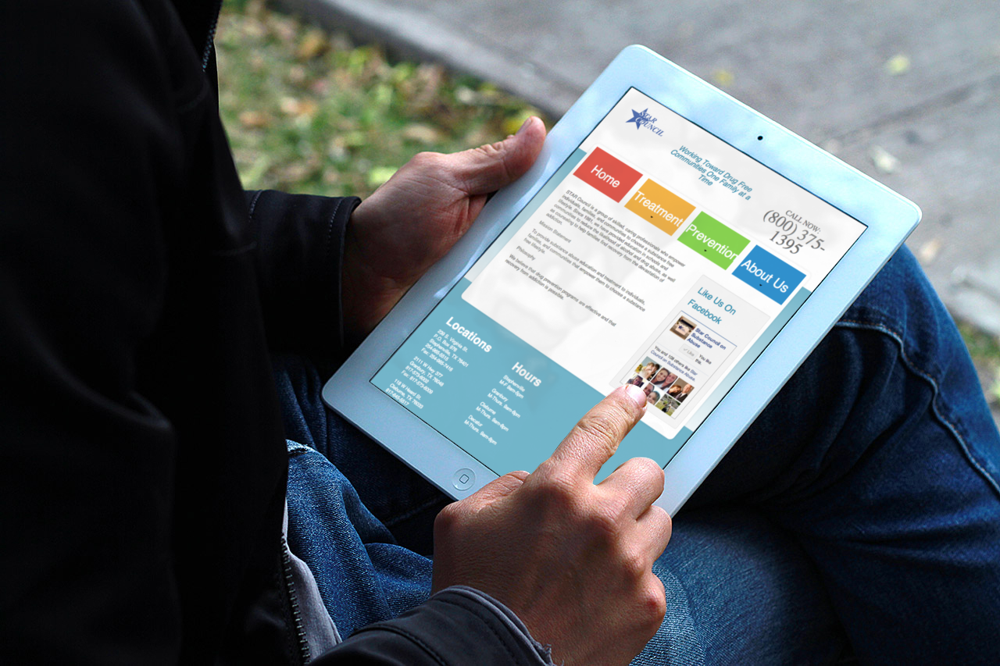

I had the privilege of working with STAR Council, which provides substance abuse education and treatment, in Texas, and has its main location in my hometown of Stephenville. It was really great to bring a fresh look to the website of a company that influenced me when I was a kid by coming into the schools and teaching us about the consequences of substance abuse and drugs.

It's a custom responsive Wordpress theme, designed by my brother, Austin, and it works well on all screen sizes.

<a href="http://www.starcouncil.org" target="_blank">Live site</a>
