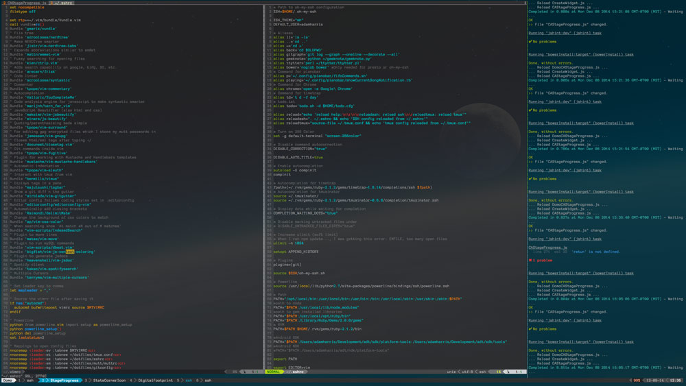

I started using iTerm 2 recently, mostly because of the ability to use the mouse inside tmux and vim so that my coworkers can still scroll through my code on my computer. Other than that, I probably would have stuck with Terminal. But, with that being said, here are my settings in iTerm.

## General Tab

I uncheck the checkbox that says "Use Lion-style Fullscreen windows" so that I can see the desktop behind, and I can also have windows on top of iTerm when it's in fullscreen. I almost always have it in fullscreen since I program in vim.

## Profiles

Open preferences and to to the Profiles tab. Create new profile and name it

### Colors tab

For the colors, I use a theme called [Solarized](http://ethanschoonover.com/solarized). It's a really nice looking theme available for a lot of platforms in a dark and light version. I use it for iTerm and vim.

- Load Presets
- Import Solarized Dark
- Then select your profile on the left, click Load Presets and select Solarized Dark
- Turn up Minimum contrast a little bit or you can’t see some text (like line numbers in grunt jshint)

### Text tab

- Check Blinking cursor
- Uncheck Draw bold text in bright colors
- Download a [patched font](https://github.com/Lokaltog/powerline-fonts)
- I use Anonymous for Powerline
- Select patched font for regular and non-ASCII (14pt)
- Check Flash visual bell

If you decide to use powerline (mentioned below), for non-ASCII, turn the vertical character spacing up a little bit until the > and < symbols on powerline don’t overlap the top.

### Window Tab

Turn up the transparency just a little

### Terminal tab

Set terminal type to xterm-256color

## Keys tab

Under Hotkey, check "Show/hide iTerm2 with a system-wide hotkey". I set mine to option-Space.

### Install zsh and oh-my-zsh

Zsh and oh-my-zsh are awesome. If you don't know what they are you should check them out.

## Remap keyboard

System Preferences -> Keyboard -> "Modifier Keys…”

For the internal keyboard:

- Change Caps Lock to Control
- Change Control to Caps Lock

For an external PC keyboard:

- Change Caps Lock to Control
- Change Control to Caps Lock
- Change Option to Command
- Change Command to Option

Setup Control to send Escape unless it's used in combination

- Download [Karabiner](https://pqrs.org/osx/karabiner/)
- Find the Change Key > Change Control_L Key (Left Control)
- Check the Control_L to Control_L (+ When you type Control_L only, send Escape) setting
- Enable it on login at System Preferences > Users & Groups > Login Items

## Other stuff

I also use tmux and vim, and I have all of my [configurations for them up on github](https://github.com/agarrharr/settings). Feel free to check it out, it's all pretty well commented.
