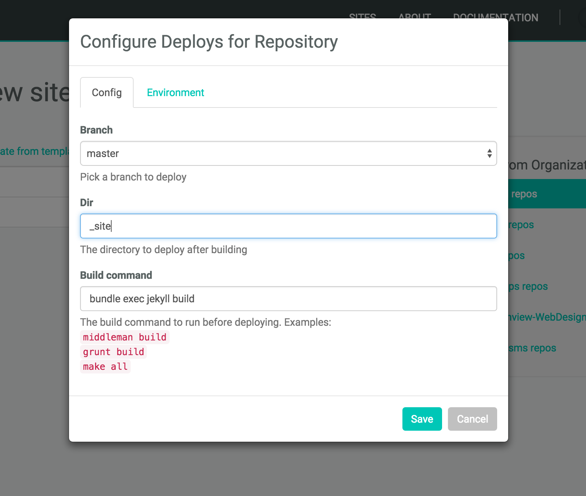

I recently discovered Netlify, which is a static website hosting service. They have a free plan, which is perfect for test sites.

You can log in with Github, click "new site", and choose your github repo that you want to deploy. One of the great things is that you can choose which branch you want to deploy from, so if you're testing out a new design for a client, you can deploy that to a test site for the client to see. And then the last step is to tell it what directory to use and what build command to run.

Since I'm using the [Github Pages Gem](https://help.github.com/articles/using-jekyll-with-pages/), I tell it to use the `_site` directory and to run the command `bundle exec jekyll build`, but if you aren't using that gem, you can probably just use `jekyll build`.

