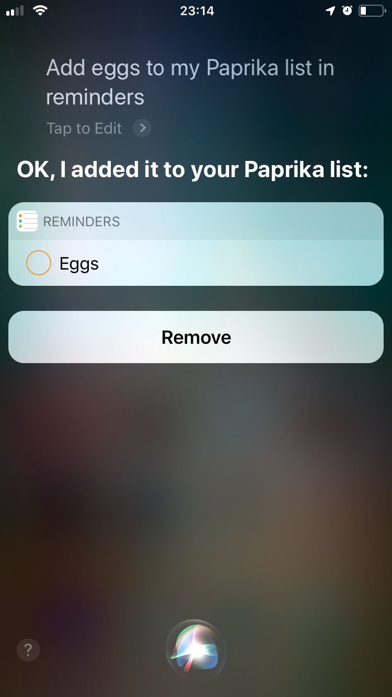
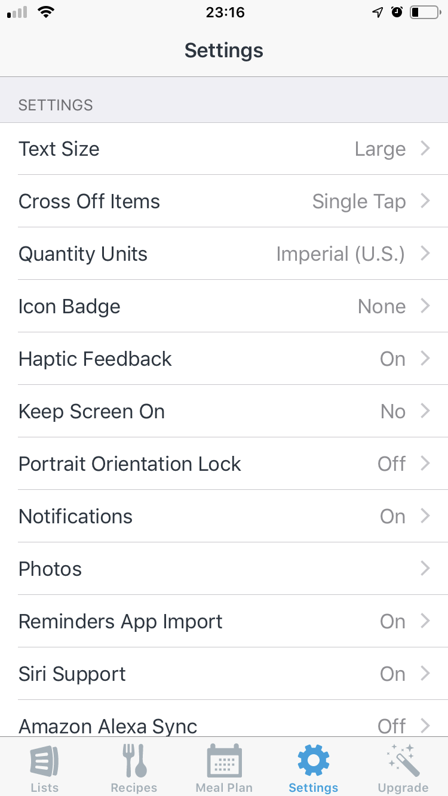
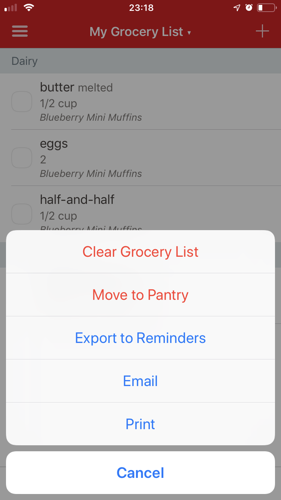

> tl;dr Use a list called "Paprika" to export grocery items from Paprika to AnyList with the Reminders app.

I use AnyList for my grocery list, and I use Paprika for recipes, meal planning, and cooking. I wanted an easy way to export my grocery items from Paprika into AnyList so that I have one source of truth for shopping.

AnyList has a great feature where it can import items **from** a Reminders list.

Paprika has a great feature where it can export items **to** a Reminders list.

The problem is that Paprika doesn't give you an option about **which list to export to**, it always exports to a list called "Paprika". And AnyList doesn't seem to have any options about **which list to import from**. Instead, AnyList will import from a list that has the same name as the list in AnyList. So for example, if you have a list named "Groceries" in Paprika, then it will only import from a list named "Groceries" in Reminders.

My workaround, is name my list in AnyList, "Paprika."

Now, when I export from Paprika in to Reminders, and then open up AnyList, it has all of the items.

## Downsides

One downside is that AnyList doesn't import from Reminders until you open the app.

Another possible downside is that it renames the list for anyone that you share the list with, so that could be a little weird, but if your spouse is using Paprika and AnyList as well, that could be what you want.

Also, in order to use Siri to add items to my list it's a little awkward now. I have to say "Add eggs to my Paprika list in Reminders."

## How to set it up

Turn on "Reminders App Import" in AnyList.

Export your grocery list from Paprika by selecting "Export to Reminders".

Then the next time you open AnyList, those items will be get pulled in from the Reminders app.
